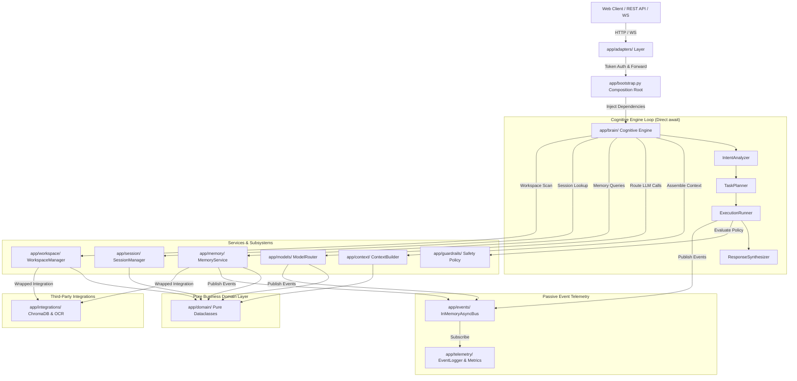
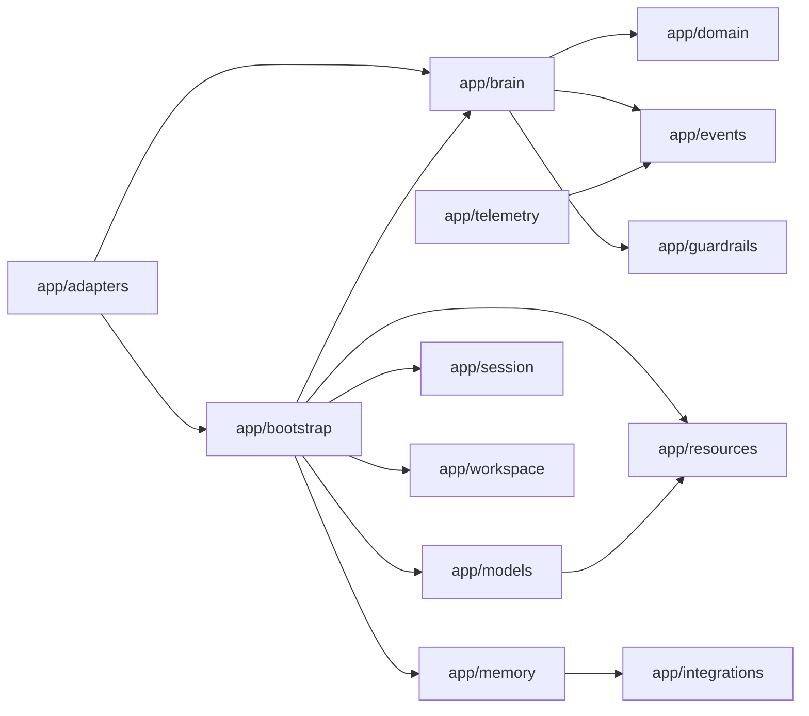

# Living Architecture & System Topology at HEAD

JARVIS is built on a **Pragmatic Hybrid Architecture** combining direct async interface execution loops for core cognitive orchestration with an `InMemoryAsyncBus` for passive telemetry, logging, metrics, streaming updates, and background jobs.

---

## 1. System Topology & Layering

---

## 2. Package Dependency & Boundary Rules

---

## 3. Data & Event Flow Architecture

1. **Incoming Request**: HTTP REST request or WebSocket message arrives at `app/adapters/`.
2. **Authentication**: `validate_api_key` verifies the Bearer token or `X-API-Key` header against `JARVIS_API_KEY`.
3. **Intent Analysis**: `IntentAnalyzer` categorizes prompt complexity (`DIRECT_CHAT`, `FILE_QUERY`, `TOOL_SEARCH`, `MULTI_STEP`).
4. **Plan Generation**: `TaskPlanner` synthesizes structured `ExecutionPlan` containing ordered `ExecutionStep` instances.
5. **Step Execution & Safety Gate**: `ExecutionRunner` executes steps. Each tool call triggers `@safety_gate`.
   - `SAFE` / `SENSITIVE`: Auto-approved or policy validated.
   - `DESTRUCTIVE`: Triggers `HITLRequestEvent` and pauses execution with `AWAITING_APPROVAL` status until explicitly confirmed.
6. **Provider Routing & Failover**: `ModelRouter` checks `ResourceManager` circuit breaker health status and routes to available LLM providers, failing over automatically on 429/503 errors.
7. **Response Synthesis & Telemetry**: `ResponseSynthesizer` outputs final response; `EventLogger` and `MetricsCollector` update passive telemetry metrics over `InMemoryAsyncBus`.
