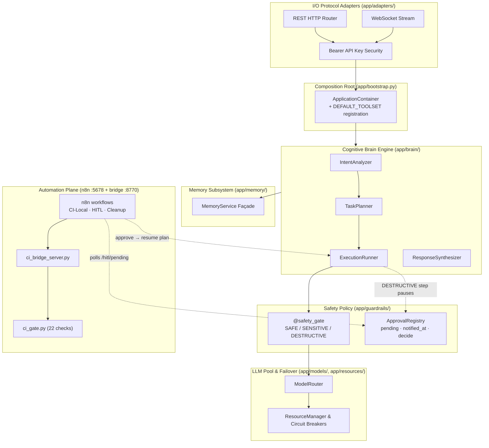

# 🤖 JARVIS — Modular Personal AI Platform

**Status**: ACTIVE
**Last Updated**: 2026-09-13

[](docs/CHANGELOG.md)
[](https://www.python.org/)
[](docs/ARCHITECTURE.md)
[](docs/CI-GATE-SOTA.md)
[](docs/DEVELOPMENT.md)
[](LICENSE)

**JARVIS** is a single-tenant personal AI platform built on a **Pragmatic Hybrid
Architecture**: direct `async/await` calls for the hot path, an event bus for
passive telemetry, and a **local automation plane (n8n)** that owns everything
scheduled — CI gating, housekeeping, and human-in-the-loop approvals.

It runs on `http://localhost:8000` as a FastAPI application with a dark-mode SPA
front end, and gates its own pull requests through a local CI engine that does not
depend on GitHub Actions.

---

## 🧭 Two planes, one system

| | Application plane | Automation plane |
|---|---|---|
| **What** | The AI platform itself | The machine that checks and maintains it |
| **Runs as** | `app.main` on `:8000` | n8n on `:5678` + CI bridge on `:8770` |
| **Owns** | Intent → plan → execute → respond | Scheduling, PR gating, HITL approvals |
| **Code** | `app/` | `n8n/workflows/*.json`, `scripts/ci_*.py` |

The automation plane is deliberately **thin**. n8n decides *when* something runs;
the actual logic lives in version-controlled, unit-testable Python under
`scripts/`. Nothing important lives only inside a workflow node.

---

## 🌟 Key Features & Capabilities

- 🧠 **Cognitive Brain Engine (`app/brain/`)**:
  - `IntentAnalyzer`: classifies prompt complexity (`DIRECT_CHAT`, `FILE_QUERY`, `TOOL_SEARCH`, `MULTI_STEP`).
  - `TaskPlanner`: generates structured `ExecutionPlan` domain objects with sequential steps.
  - `ExecutionRunner`: runs plan steps against a registered tool registry, evaluating safety policy and pausing on `AWAITING_APPROVAL`.
  - `ResponseSynthesizer`: formats output and step-execution provenance.

- 🛡️ **Tiered Tool Safety Policy & HITL Gate (`app/guardrails/`)**:
  - `@safety_gate` decorators classify every tool `SAFE` (auto-pass), `SENSITIVE` (policy-checked), or `DESTRUCTIVE` (mandatory human approval).
  - A `DESTRUCTIVE` step **pauses the plan**; n8n notices it, posts to Slack once, and resumes the plan only when a human approves — or auto-denies after 30 minutes. See `docs/adr/ADR-011-tool-wiring-and-hitl-gate.md`.

- ⚡ **Multi-Provider LLM Pool & Circuit Breakers (`app/models/`, `app/resources/`)**:
  - `ResourceManager` tracks RPM/TPM budgets and 3-state circuit breakers (`CLOSED`, `OPEN`, `HALF_OPEN`).
  - `ModelRouter` routes around failing providers to healthy fallbacks.

- 💾 **Hybrid Memory Subsystem (`app/memory/`)**:
  - `MemoryService` façade combining ChromaDB semantic vector search and BM25 keyword retrieval.

- 🌐 **Web UI & FastAPI Server (`app/adapters/`, `frontend/`)**:
  - REST routes and WebSocket streaming with single-tenant Bearer auth (`JARVIS_API_KEY`).
  - Dark-mode SPA served from `frontend/`.

- ⚙️ **Local Automation Plane (`n8n/`, `scripts/`)**:
  - Three n8n workflows gate PRs, clean up branches, and drive the HITL loop.
  - A 22-check CI engine (`scripts/ci_gate.py`) publishes 8 commit-status contexts back to GitHub.

---

## 📐 Architecture Overview



---

## 🚀 Quickstart

### 1. Environment setup

```bash
cd ~/Projects/JARVIS

# Python 3.11 or 3.12
python3.11 -m venv .venv
source .venv/bin/activate

pip install -r requirements.txt
```

### 2. Configure

```bash
cp .env.example .env
# Generate the API key and add it:
echo "JARVIS_API_KEY=$(openssl rand -hex 32)" >> .env
```

Only the variables you actually use are required. `.env` is gitignored — never commit it.

### 3. Run the API

```bash
.venv/bin/python -m app.main
```

Serves the REST/WS API and the SPA on **`http://localhost:8000`**.
Interactive API docs: `http://localhost:8000/docs`.

> Historically this was `python -m app.api.server`. That module was archived to
> `legacy/server.py` and is no longer importable from `app/`; `app.main` is the only
> entry point. `legacy/` is tracked for reference only and is not part of the runtime.

### 4. Run the tests

```bash
.venv/bin/python -m pytest tests -q --ignore=tests/sprint4
```

### 5. Version bump

```bash
python3 scripts/bump_version.py patch|minor|major
```

---

## ⚙️ The Automation Plane (n8n)

n8n runs locally on **`http://localhost:5678`** as a systemd user service
(`jarvis-n8n.service`). It exists because GitHub Actions is billing-blocked on this
private repo — the entire CI/CD function was moved onto this machine.

Three workflows are published and active:

| Workflow | Trigger | What it does |
|---|---|---|
| **JARVIS-CI-Local** | every 30 min + manual | Calls the CI bridge, gates open PRs, publishes commit statuses, reports to Slack |
| **JARVIS-HITL** | every 5 min + webhook | Polls for approvals awaiting a human, notifies Slack once, accepts the decision, auto-denies after 30 min |
| **JARVIS-Cleanup** | Mondays 04:00 | Deletes merged branches, closes stale Dependabot PRs, prunes old workflow runs |

### Editing workflows

Workflows are authored as JSON in `n8n/workflows/*.json` and imported into n8n's
database. **The database is what actually runs**; the repo file is the reviewable
record. To read back a change made in the UI:

```bash
N8N_USER_FOLDER=/home/sajan n8n export:workflow \
  --id=<workflow-id> --output=n8n/workflows/<NAME>.json --pretty
```

Two things that bite: a workflow runs only when `active=1` **and**
`activeVersionId = versionId` (Save writes a draft; Publish makes it live), and the
n8n data dir is `$N8N_USER_FOLDER/.n8n` — set the *parent*, not the `.n8n` dir.

Full walkthrough: `docs/N8N-SETUP.md` · handover notes: `docs/N8N-HANDOVER.md`

---

## 🔍 Local CI Gate

`JARVIS-CI-Local` POSTs to a localhost bridge (`scripts/ci_bridge_server.py`, bound
to `127.0.0.1:8770`, token-authenticated). The bridge runs `scripts/ci_bridge.py`,
which lists open PRs, gates each **merge result** in a shadow worktree, and
publishes the outcome.

**22 checks** in `scripts/ci_gate.py`:

```
ruff_ratchet  mypy  pytest  contract  coverage  mutation
bandit  semgrep  gitleaks  trufflehog  pip_audit  osv  trivy_fs  licenses
sbom  provenance  checkov  hadolint  docker_build  compileall  commitlint  board
```

They aggregate into **8 published commit-status contexts**:

```
Lint & Typecheck · SAST · Tests · Security Scan · Supply Chain
Conventional Commits · Virtual Board Governance · Build
```

A ninth context, `Mutation Testing`, is defined but does not publish: mutation
testing is opt-in (`--with-mutation`) and `mutmut` is not installed on this
machine, so the gate returns `skip` and the bridge omits it rather than
reporting a pass it did not earn.

Two honesty rules the gate enforces on itself, because both were violated before:

1. **A gate that scanned zero things is not a pass.** (`pip-licenses` silently
   scanned 0 packages for weeks.)
2. **A run that published zero statuses is not a pass.** The bridge reports
   `published=N/M` and exits non-zero if publishing failed — a green gate that
   reached no one is worse than a red one.

Verify a run yourself:

```bash
TOKEN=$(grep -m1 '^CI_BRIDGE_TOKEN=' .ci-bridge.env | cut -d= -f2-)
curl -s -X POST http://127.0.0.1:8770/run \
  -H "Content-Type: application/json" -H "X-Bridge-Token: $TOKEN" \
  -d '{"limit":1,"dryRun":false}'
```

Details and the threat model: `docs/CI-GATE-SOTA.md`

---

## 🛂 Human-in-the-Loop Approvals

A `DESTRUCTIVE` tool call (e.g. creating a directory) never executes on its own:

1. The plan pauses; the step is registered in `ApprovalRegistry` with `notified_at=None`.
2. n8n polls `GET /api/v1/hitl/pending` and posts to Slack **once** per approval.
3. A human approves or denies — via the n8n webhook, or `POST /api/v1/hitl/approve`.
4. The plan resumes; the tool runs. Unanswered approvals auto-deny after 30 minutes.

```bash
curl -s http://localhost:8000/api/v1/hitl/pending -H "X-API-Key: $JARVIS_API_KEY"
```

Notification state lives in JARVIS (`notified_at`), **not** in n8n static data —
static data does not persist reliably across restarts in this n8n build.

---

## 🏛️ Governance

- **8 governance checks** run in CI: import layering, domain purity, schema drift,
  prerequisite graph, safety-gate coverage, MCP tool search, OTEL spans, LangGraph checkpoint.
- **13 ADRs** in `docs/adr/` (ADR-001 → ADR-013), including
  [ADR-011](docs/adr/ADR-011-tool-wiring-and-hitl-gate.md) (tool wiring + HITL) and
  [ADR-012](docs/adr/ADR-012-github-auth-identity-per-function.md) (one GitHub identity per function).
- **16 tracked risks** in [`docs/ACCEPTED_RISKS.md`](docs/ACCEPTED_RISKS.md) — every
  CRITICAL/HIGH finding has a named owner and a review date. Acknowledging a risk adds
  evidence; it never removes the finding.

Run the governance suite:

```bash
.venv/bin/python scripts/board/review.py
```

---

## 📚 Documentation

Start at **[`docs/INDEX.md`](docs/INDEX.md)** — the master navigation map.

| Document | Purpose |
|---|---|
| [docs/ARCHITECTURE.md](docs/ARCHITECTURE.md) | Living topology, package boundaries, invariants |
| [docs/GOVERNANCE.md](docs/GOVERNANCE.md) | Decision authority, branching, quality gates, release process |
| [docs/DEVELOPMENT.md](docs/DEVELOPMENT.md) | Daily workflow, testing standards, git conventions |
| [docs/API_CONTRACT.md](docs/API_CONTRACT.md) | REST/WS endpoints, auth, error codes |
| [docs/CI-GATE-SOTA.md](docs/CI-GATE-SOTA.md) | The local CI engine in detail |
| [docs/N8N-SETUP.md](docs/N8N-SETUP.md) | Standing up and editing the automation plane |
| [docs/GITHUB-APP-SETUP.md](docs/GITHUB-APP-SETUP.md) | Migrating CI auth off long-lived PATs |
| [docs/ACCEPTED_RISKS.md](docs/ACCEPTED_RISKS.md) | Risk register with owners and review dates |
| [docs/ROADMAP.md](docs/ROADMAP.md) | Sprint plan and technical debt register |
| [docs/CHANGELOG.md](docs/CHANGELOG.md) | Release notes |
| [docs/DEVLOG.md](docs/DEVLOG.md) | Why decisions were made, alternatives rejected |
| [docs/adr/](docs/adr/) | Architecture Decision Records (ADR-001 → ADR-013) |

Repository: <https://github.com/Er-Sajan-PLG/JARVIS>

---

## 📜 License

ISC — see [LICENSE](LICENSE).
