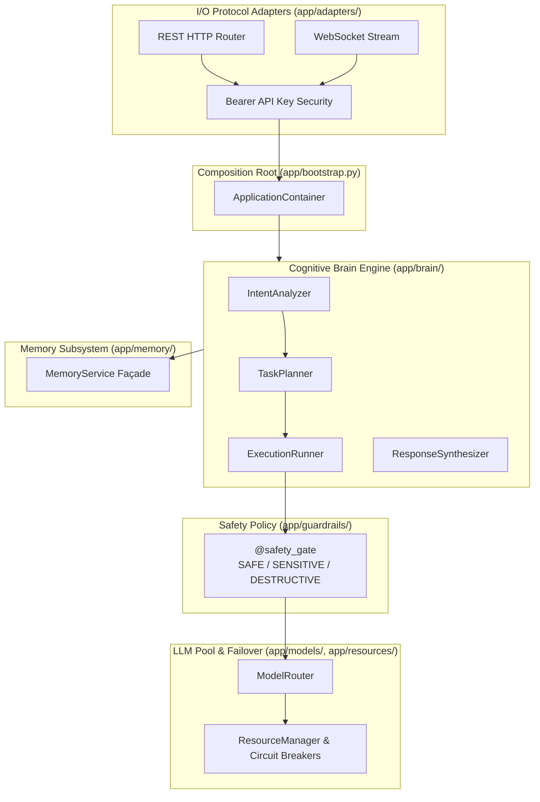

# 🤖 JARVIS — Modular Personal AI Platform

[](file:///home/sajan/JARVIS/docs/CHANGELOG.md)
[](https://www.python.org/)
[](file:///home/sajan/JARVIS/docs/ARCHITECTURE.md)
[](file:///home/sajan/JARVIS/docs/HEALTH_REPORT.md)
[](file:///home/sajan/JARVIS/package.json)

**JARVIS** is a high-performance, single-tenant personal AI platform engineered with a **Pragmatic Hybrid Architecture**:
1. **Direct Async Execution**: Core orchestration loops (Cognitive Engine: Intent Analyzer ➔ Task Planner ➔ Execution Runner ➔ Response Synthesizer) use direct `async/await` interface calls for minimum latency.
2. **InMemoryAsyncBus**: Passive event bus publishing telemetry events, token metrics, step execution logs, and background job notifications.

---

## 🌟 Key Features & Capabilities

- 🧠 **Cognitive Brain Engine (`app/brain/`)**:
  - `IntentAnalyzer`: Classifies prompt complexity (`DIRECT_CHAT`, `FILE_QUERY`, `TOOL_SEARCH`, `MULTI_STEP`).
  - `TaskPlanner`: Generates structured `ExecutionPlan` domain objects with sequential steps.
  - `ExecutionRunner`: Runs plan steps evaluating safety policies and handling HITL approval pause states (`AWAITING_APPROVAL`).
  - `ResponseSynthesizer`: Formats output streams and step execution provenance.

- 🛡️ **Tiered Tool Safety Policy & Guardrails (`app/guardrails/`)**:
  - Enforces `@safety_gate` policy decorators categorizing operations into `SAFE` (auto-pass), `SENSITIVE` (policy-checked), and `DESTRUCTIVE` (mandatory Human-In-The-Loop approval gate).

- ⚡ **Multi-Provider LLM Pool & Circuit Breakers (`app/models/`, `app/resources/`)**:
  - `ResourceManager` tracks RPM/TPM token budgets and 3-state circuit breakers (`CLOSED`, `OPEN`, `HALF_OPEN`).
  - `ModelRouter` automatically routes requests around failing providers to healthy fallbacks (Ollama, llama.cpp, Google AI Studio, Groq, Cerebras, SambaNova, NVIDIA NIM, OpenRouter).

- 💾 **Hybrid Memory Subsystem (`app/memory/`)**:
  - `MemoryService` façade combining ChromaDB semantic vector search and BM25 keyword retrieval.

- 🌐 **Modern Web UI & FastAPI Server (`app/adapters/`, `frontend/`)**:
  - REST HTTP routes & WebSocket bidirectional streaming server with Bearer key security (`JARVIS_API_KEY`).
  - Modern dark-mode Single-Page Application (`frontend/`).

---

## 📐 Architecture Overview



---

## 🚀 Quickstart & Setup

### 1. Environment Setup
```bash
# Create and activate virtual environment
python3 -m venv .venv
source .venv/bin/activate

# Install dependencies
pip install -r requirements.txt
```

### 2. Launch FastAPI Server
```bash
.venv/bin/python -m app.api.server
```
*Access Web UI at `http://localhost:8080` (or `frontend/index.html`).*

### 3. Run Automated Tests
```bash
.venv/bin/python -m pytest tests/
```

### 4. Automated Version Bumping
```bash
python3 scripts/bump_version.py bump patch -m "Description of changes"
```

---

## 📚 Complete Documentation Directory

Explore the complete, version-by-version documentation in [`docs/`](file:///home/sajan/JARVIS/docs):

- 🗺️ **[docs/INDEX.md](file:///home/sajan/JARVIS/docs/INDEX.md)**: Master Navigation Map & LLM Guide
- 📐 **[docs/ARCHITECTURE.md](file:///home/sajan/JARVIS/docs/ARCHITECTURE.md)**: Living Architecture & System Invariants
- 🔌 **[docs/API.md](file:///home/sajan/JARVIS/docs/API.md)**: Public API Reference & Method Signatures
- 📝 **[docs/CHANGELOG.md](file:///home/sajan/JARVIS/docs/CHANGELOG.md)**: Release Notes (`v0.1.0` ➔ `v3.0.1`)
- 💻 **[docs/DEVLOG.md](file:///home/sajan/JARVIS/docs/DEVLOG.md)**: Developer Architectural Evolution Log
- 📜 **[docs/HISTORY.md](file:///home/sajan/JARVIS/docs/HISTORY.md)**: Git Archaeology & Milestone Timeline
- 🩺 **[docs/DEBUGGING.md](file:///home/sajan/JARVIS/docs/DEBUGGING.md)**: Diagnostic Error Matrix & Verified Fixes
- 🛣️ **[docs/ROADMAP.md](file:///home/sajan/JARVIS/docs/ROADMAP.md)**: Technical Debt Register (`DEBT-001` - `DEBT-007`)
- 🏥 **[docs/HEALTH_REPORT.md](file:///home/sajan/JARVIS/docs/HEALTH_REPORT.md)**: Repository Health Metrics
- 🧩 **[docs/architecture/](file:///home/sajan/JARVIS/docs/architecture/)**: High-Level Flowcharts (Components, Brain, Routing, Memory, Data Flow, Bootstrap)
- 📦 **[docs/modules/](file:///home/sajan/JARVIS/docs/modules/)**: Subsystem Module Documentation (Domain, Brain, Models, Memory, Guardrails, Adapters, Integrations)
- 📋 **[docs/adr/](file:///home/sajan/JARVIS/docs/adr/)**: Architectural Decision Records (ADR-001 through ADR-010)
- 📊 **[docs/metadata/](file:///home/sajan/JARVIS/docs/metadata/)**: Extracted JSON Symbol & Module Lineage Graphs

---

## 📜 License

This project is licensed under the [ISC License](file:///home/sajan/JARVIS/package.json).
