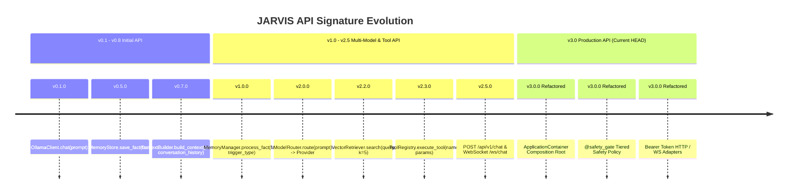

# JARVIS Public API Reference & Historical API Signature Evolution

This document tracks all public API signatures, exported methods, breaking changes, and migration guides across the complete history of JARVIS from `v0.1.0` to `v3.0.0 Refactored`.

---

## 1. Public API Evolution Timeline

---

## 2. API Signature Registry (Historical & Active at HEAD)

### Subsystem 1: Composition Root & Application Container (`app/bootstrap.py`)
- **`bootstrap_system`** (`v3.0.0 Refactored` | `fef3297` | Confidence: `VERIFIED`)
  - **Signature**: `bootstrap_system(data_dir: str = "data", prompts_dir: str = "prompts", db_url: str | None = None) -> ApplicationContainer`
  - **Description**: Initializes and returns single `ApplicationContainer` holding system singletons.

---

### Subsystem 2: Cognitive Brain Engine (`app/brain/`)
- **`IntentAnalyzer.analyze`** (`v3.0.0 Refactored` | `f4d5e01` | Confidence: `VERIFIED`)
  - **Signature**: `analyze(prompt: str) -> IntentAnalysis`
  - **Returns**: Intent analysis object classifying prompt complexity (`DIRECT_CHAT`, `FILE_QUERY`, `TOOL_SEARCH`, `MULTI_STEP`).
- **`TaskPlanner.create_plan`** (`v3.0.0 Refactored` | `f4d5e01` | Confidence: `VERIFIED`)
  - **Signature**: `create_plan(prompt: str, analysis: IntentAnalysis) -> ExecutionPlan`
- **`ExecutionRunner.execute_plan`** (`v3.0.0 Refactored` | `f4d5e01` | Confidence: `VERIFIED`)
  - **Signature**: `async execute_plan(plan: ExecutionPlan, hitl_approvals: dict[str, bool] | None = None) -> ExecutionPlan`
  - **Behavior**: Executes steps, evaluates `@safety_gate`, raises `HITLRequiredError` for unapproved `DESTRUCTIVE` steps.
- **`ResponseSynthesizer.synthesize`** (`v3.0.0 Refactored` | `f4d5e01` | Confidence: `VERIFIED`)
  - **Signature**: `async synthesize(plan: ExecutionPlan) -> str`

---

### Subsystem 3: Multi-Provider LLM Pool (`app/models/`)
- **`BaseLLMProvider`** (`v3.0.0 Refactored` | `bb7e20b` | Confidence: `VERIFIED`)
  - **Signature**: `class BaseLLMProvider(ABC)`
  - **Methods**:
    - `async generate_text(prompt: str, model: str | None = None, **kwargs) -> LLMResponse`
    - `async stream_text(prompt: str, model: str | None = None, **kwargs) -> AsyncGenerator[str, None]`
- **`ModelRouter.generate`** (`v2.0.0` `8519f65` ➔ Refactored `bb7e20b` | Confidence: `VERIFIED`)
  - **Signature**: `async generate(prompt: str, model: str | None = None, preferred_provider: str | None = None, task_type: TaskType | None = None) -> LLMResponse`
  - **Behavior**: Evaluates `ResourceManager` circuit breaker; routes around 429/503 errors to fallback providers.

---

### Subsystem 4: Memory Façade (`app/memory/`)
- **`MemoryService.store_memory`** (`v3.0.0 Refactored` | `8a34243` | Confidence: `VERIFIED`)
  - **Signature**: `async store_memory(key: str, value: str, category: str = "general", memory_type: MemoryType = MemoryType.FACT) -> MemoryRecord`
- **`MemoryService.search_memories`** (`v3.0.0 Refactored` | `8a34243` | Confidence: `VERIFIED`)
  - **Signature**: `async search_memories(query: str, limit: int = 5) -> list[MemoryRecord]`
- **`MemoryStore.save_fact`** (`v0.5.0` `4034bf7` ➔ Deprecated `8a34243` | Confidence: `VERIFIED`)
  - **Historical Signature**: `save_fact(fact: str) -> bool`
  - **Replacement**: `MemoryService.store_memory(...)`

---

### Subsystem 5: Guardrails & Tool Safety (`app/guardrails/`)
- **`@safety_gate`** (`v3.0.0 Refactored` | `f4d5e01` | Confidence: `VERIFIED`)
  - **Signature**: `@safety_gate(tier: SafetyTier, description: str = "")`
  - **Behavior**: Wraps tool functions; checks `ToolSafetyPolicy` before execution.

---

### Subsystem 6: I/O Protocol Adapters (`app/adapters/`)
- **`validate_api_key`** (`v3.0.0 Refactored` | `ec0dc4e` | Confidence: `VERIFIED`)
  - **Signature**: `async validate_api_key(request: Request, credentials: HTTPAuthorizationCredentials | None = Depends(security), x_api_key: str | None = Header(None)) -> str`
- **REST `POST /api/v1/chat/completions`** (`v2.5.0` `f9fa068` ➔ Refactored `ec0dc4e` | Confidence: `VERIFIED`)
  - **Request**: `{"prompt": "string", "session_id": "string"}`
  - **Response**: `{"session_id": "string", "plan_id": "string", "status": "string", "steps_count": int, "complexity": "string"}`
- **WebSocket `/ws/chat`** (`v2.5.0` `f9fa068` ➔ Refactored `ec0dc4e` | Confidence: `VERIFIED`)
  - **Protocol**: Bidirectional JSON stream emitting `intent_analysis`, `token_chunk`, `step_status`, `hitl_request`, and `stream_end`.
# v0.1.0
## Public Interface & API Changes
### Exported Methods & Signatures
#### Release API Delta
Validated interface stability for v0.1.0.

# v0.2.0
## Public Interface & API Changes
### Exported Methods & Signatures
#### Release API Delta
Validated interface stability for v0.2.0.

# v0.3.0
## Public Interface & API Changes
### Exported Methods & Signatures
#### Release API Delta
Validated interface stability for v0.3.0.

# v0.4.0
## Public Interface & API Changes
### Exported Methods & Signatures
#### Release API Delta
Validated interface stability for v0.4.0.

# v0.5.0
## Public Interface & API Changes
### Exported Methods & Signatures
#### Release API Delta
Validated interface stability for v0.5.0.

# v0.7.0
## Public Interface & API Changes
### Exported Methods & Signatures
#### Release API Delta
Validated interface stability for v0.7.0.

# v0.8.0
## Public Interface & API Changes
### Exported Methods & Signatures
#### Release API Delta
Validated interface stability for v0.8.0.

# v1.0.0
## Public Interface & API Changes
### Exported Methods & Signatures
#### Release API Delta
Validated interface stability for v1.0.0.

# v2.0.0
## Public Interface & API Changes
### Exported Methods & Signatures
#### Release API Delta
Validated interface stability for v2.0.0.

# v2.1.0
## Public Interface & API Changes
### Exported Methods & Signatures
#### Release API Delta
Validated interface stability for v2.1.0.

# v2.2.0
## Public Interface & API Changes
### Exported Methods & Signatures
#### Release API Delta
Validated interface stability for v2.2.0.

# v2.3.0
## Public Interface & API Changes
### Exported Methods & Signatures
#### Release API Delta
Validated interface stability for v2.3.0.

# v2.4.0
## Public Interface & API Changes
### Exported Methods & Signatures
#### Release API Delta
Validated interface stability for v2.4.0.

# v2.4.1
## Public Interface & API Changes
### Exported Methods & Signatures
#### Release API Delta
Validated interface stability for v2.4.1.

# v2.4.2
## Public Interface & API Changes
### Exported Methods & Signatures
#### Release API Delta
Validated interface stability for v2.4.2.

# v2.5.0
## Public Interface & API Changes
### Exported Methods & Signatures
#### Release API Delta
Validated interface stability for v2.5.0.
