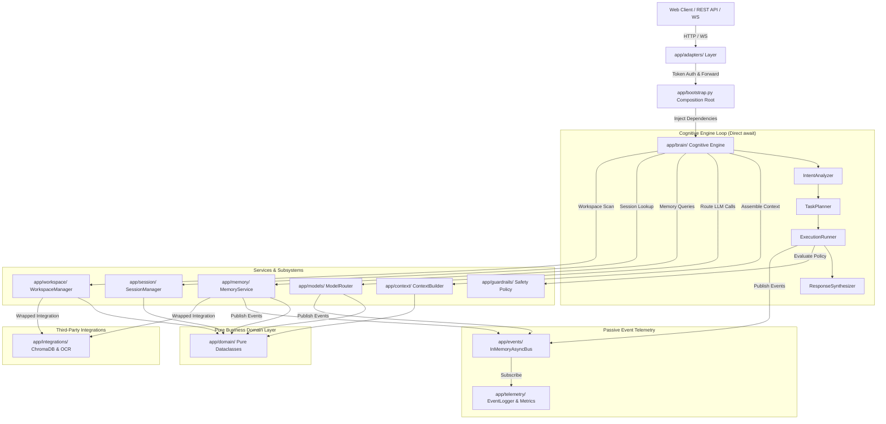
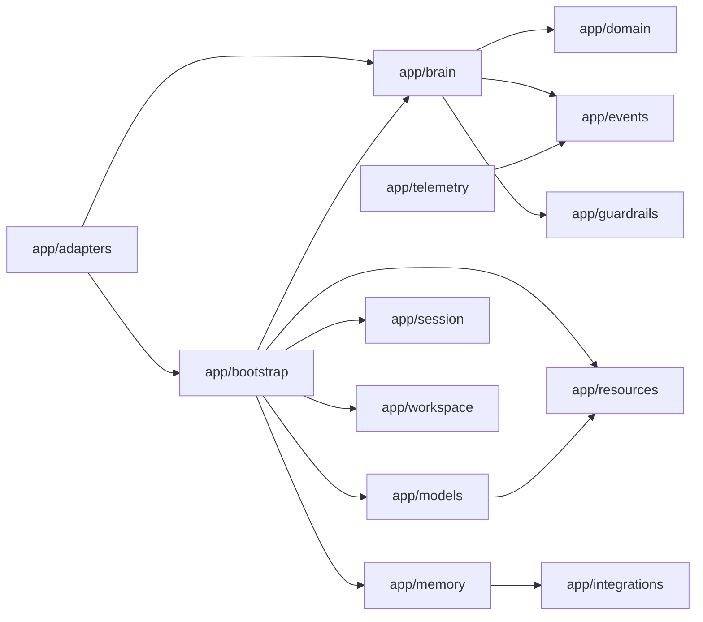

# JARVIS Architecture — Living Document v3.0.0

**Status**: ACTIVE
**Last Updated**: 2026-09-13
**Source**: `app/` at HEAD (this document describes HEAD, not a pinned commit)

**Workflow Orchestration**: JARVIS orchestrates; n8n schedules and notifies (ADR-013)

---

## 1. System Overview

JARVIS is a **single-tenant personal AI platform** built on a **Pragmatic Hybrid Architecture**:

- **Direct Async Execution Loops** — Core cognitive orchestration (Intent → Plan → Execute → Synthesize) uses direct `async/await` interface calls for minimum latency
- **InMemoryAsyncBus** — Passive event bus for telemetry, token metrics, step execution logs, background job notifications (never the data path for state)
- **External Scheduling & Notification** — n8n owns *when* scheduled work runs and *how the outside world is told* (ADR-013). It is not the policy engine and not the state store: every deterministic decision lives in version-controlled Python under `scripts/` and `app/`.

---

## 2. System Topology

```
┌─────────────────────────────────────────────────────────────────────────────┐
│                              JARVIS RUNTIME                                 │
├─────────────────────────────────────────────────────────────────────────────┤
│                                                                             │
│  ┌──────────────┐     ┌────────────────────────────────────────────────┐  │
│  │   CLIENTS    │────▶│          app/main.py (FastAPI)                 │  │
│  │  HTTP / WS   │     │  ├─ CORSMiddleware (configurable origins)      │  │
│  └──────────────┘     │  ├─ StaticFiles → /frontend                    │  │
│                       │  ├─ http_router (REST + Bearer Auth)           │  │
│                       │  └─ ws_router (WS + SSE, auth REQUIRED)        │  │
│                       └────────────────┬───────────────────────────────┘  │
│                                        │ bootstrap_system()                │
│                                        ▼                                  │
│  ┌────────────────────────────────────────────────────────────────────┐  │
│  │              app/bootstrap.py — Composition Root                   │  │
│  │  ApplicationContainer {                                            │  │
│  │    brain: IntentAnalyzer, TaskPlanner, ExecutionRunner,            │  │
│  │           ResponseSynthesizer         ← Cognitive Engine Loop      │  │
│  │    events: InMemoryAsyncBus                                     ←  │  │
│  │    models: ModelRouter + ResourceManager (circuit breakers)      ←  │  │
│  │    memory: MemoryService (ChromaDB + BM25 hybrid)                ←  │  │
│  │    guardrails: ToolSafetyPolicy @safety_gate (SAFE/SENSITIVE/      │  │
│  │                DESTRUCTIVE)                                      ←  │  │
│  │    prompt: PromptLoader (Jinja2, mtime-cached)                   ←  │  │
│  │    session: SessionManager + SessionPersistence                  ←  │  │
│  │    workspace: WorkspaceManager                                    ←  │  │
│  │    telemetry: EventLogger, MetricsCollector, Tracer              ←  │  │
│  │    artifacts: ArtifactManager                                     ←  │  │
│  │  }                                                                │  │
│  └────────────────────────────────────────────────────────────────────┘  │
│                                                                             │
│  ┌────────────────────────────────────────────────────────────────────┐  │
│  │                    EXTERNAL ORCHESTRATION (n8n)                    │  │
│  │  • Workflow automation & scheduling                                │  │
│  │  • Integration flows (webhooks, APIs, triggers)                  │  │
│  │  • Human-in-the-loop approval gates                               │  │
│  │  • Communicates with JARVIS via REST API (/api/v1/*)             │  │
│  └────────────────────────────────────────────────────────────────────┘  │
└─────────────────────────────────────────────────────────────────────────────┘
```

---

### Topology (rendered)



### Package boundaries (rendered)



## 3. Cognitive Engine Loop (Direct Async)

```
User Request
     │
     ▼
┌──────────────────────────────────────────────────────────────┐
│  app/brain/IntentAnalyzer.analyze(prompt)                    │
│  → IntentAnalysis { complexity: DIRECT_CHAT | FILE_QUERY |   │
│       TOOL_SEARCH | MULTI_STEP, requires_tools, safety_flags }│
└──────────────────────────┬───────────────────────────────────┘
                           │
                           ▼
┌──────────────────────────────────────────────────────────────┐
│  app/brain/TaskPlanner.create_plan(prompt, analysis)         │
│  → ExecutionPlan { plan_id, steps: [ExecutionStep], status } │
└──────────────────────────┬───────────────────────────────────┘
                           │
                           ▼
┌──────────────────────────────────────────────────────────────┐
│  app/brain/ExecutionRunner.execute_plan(plan, hitl_approvals)│
│  → For each step:                                            │
│     1. @safety_gate evaluates tier (SAFE/SENSITIVE/DESTRUCTIVE)│
│     2. DESTRUCTIVE → HITLRequestEvent → PAUSE (AWAITING_APPROVAL)│
│     3. Execute tool via registered handler                    │
│     4. Publish StepExecutionEvent to InMemoryAsyncBus        │
└──────────────────────────┬───────────────────────────────────┘
                           │
                           ▼
┌──────────────────────────────────────────────────────────────┐
│  app/brain/ResponseSynthesizer.synthesize(plan)              │
│  → Formatted response with provenance                         │
└──────────────────────────────────────────────────────────────┘
```

**Key Invariant**: No event bus in the data path. Events are **telemetry only**.

---

## 4. Package Boundary Rules (Enforced by Architecture)

```
app/adapters      → app/bootstrap, app/brain
app/bootstrap     → app/brain, app/models, app/resources, app.memory,
                    app.session, app.workspace, app.prompt, app.telemetry
app/brain         → app.domain, app.events, app.guardrails
app.models        → app.resources
app.memory        → app.integrations (ChromaDB, OCR)
app.telemetry     → app.events
app.guardrails    → (standalone, no deps)
```

**Rule**: No reverse dependencies. No circular imports. Violations = build failure.

---

## 5. Security Model

| Layer | Mechanism | Enforcement |
|-------|-----------|-------------|
| **Transport** | TLS termination at edge (Cloudflare) | Required for production |
| **API Auth** | Bearer Token (`JARVIS_API_KEY`) + X-API-Key header | `app/adapters/http/router.py:validate_api_key` |
| **WS Auth** | Same credential as HTTP, plus `?api_key=` for browsers | `app/adapters/security.py:is_authorized` — unauthenticated upgrade closed with 1008 |
| **Tool Safety** | `@safety_gate(tier)` decorator | Runtime wrapper — blocks DESTRUCTIVE without HITL |
| **Secrets** | `.env` only, never committed | `.gitignore` enforced |
| **n8n → JARVIS** | API key rotation, scoped credentials | n8n stores JARVIS_API_KEY in encrypted credentials |

---

## 6. Data Flow Architecture

```
Request (HTTP/WS)
     │
     ▼
validate_api_key (Bearer/X-API-Key)
     │
     ▼
http_router.chat_completions / ws_router.websocket_endpoint
     │
     ▼
bootstrap_system() → ApplicationContainer (singleton)
     │
     ▼
SessionManager.get_session(session_id)
     │
     ▼
IntentAnalyzer.analyze(prompt)
     │
     ▼
TaskPlanner.create_plan(prompt, analysis)
     │
     ▼
ExecutionRunner.execute_plan(plan)
     │  ├─ @safety_gate check per tool
     │  ├─ ModelRouter.generate() with circuit breaker failover
     │  ├─ MemoryService.search_memories() for context
     │  └─ InMemoryAsyncBus.publish(StepExecutionEvent)
     │
     ▼
ResponseSynthesizer.synthesize(plan)
     │
     ▼
Streamed Response (SSE/WS) or JSON (REST)
```

---

## 7. Memory Subsystem (Hybrid)

```
┌─────────────────────────────────────────────────────────────┐
│                    MemoryService (Façade)                   │
├─────────────────────────────────────────────────────────────┤
│  store_memory(key, value, category, memory_type)            │
│  search_memories(query, limit=5) → List[MemoryRecord]       │
└──────────────────────────┬──────────────────────────────────┘
                           │
              ┌────────────┴────────────┐
              ▼                         ▼
     ┌─────────────────┐      ┌─────────────────┐
     │  ChromaDB       │      │  BM25           │
     │  Vector Search  │      │  Keyword Search │
     │  (dense)        │      │  (sparse)       │
     └────────┬────────┘      └────────┬────────┘
              │                        │
              └────────────┬───────────┘
                           ▼
              ┌─────────────────────────┐
              │  Hybrid Ranker          │
              │  (configurable weights) │
              └─────────────────────────┘
```

---

## 8. LLM Provider Pool & Failover

```
ModelRouter
     │
     ├─ register_provider(provider, default?)
     │
     ├─ generate(prompt, model?, preferred_provider?, task_type?)
     │     │
     │     ├─ ResourceManager.check_health(provider)
     │     │     ├─ CLOSED → proceed
     │     │     ├─ OPEN → skip to next provider
     │     │     └─ HALF_OPEN → test request
     │     │
     │     └─ On 429/503 → circuit_breaker.trip() → failover
     │
     └─ Providers (config.yaml):
           • local_general (llamacpp, Ollama-compatible)
           • grok (xAI)
           • openrouter (qwen/qwen3-coder:free)
           • google_general (gemini-2.0-flash)
```

---

## 9. n8n Integration Contract

| Aspect | Specification |
|--------|---------------|
| **Authentication** | n8n uses `JARVIS_API_KEY` via Bearer header |
| **Endpoints** | `POST /api/v1/chat/completions`, `GET /api/v1/health`, `WS /ws/chat` |
| **Workflow Triggers** | n8n webhook nodes → JARVIS REST API |
| **Human-in-the-Loop** | n8n "Wait for Webhook" / "Manual Approval" nodes → JARVIS HITL endpoints |
| **State** | n8n owns *scheduling* state. JARVIS owns domain state (memory, sessions, approvals) and is request-scoped per call (`session_id`). |
| **Error Handling** | n8n retries with exponential backoff; JARVIS returns structured errors |
| **Who decides CI** | `scripts/ci_gate.py` — **not** n8n. n8n's CI workflow only *calls* the bridge that invokes the gate (ADR-013). |
| **HITL direction** | One-way: n8n **polls** `GET /api/v1/hitl/pending`. The app never calls into n8n, so n8n can be stopped without breaking JARVIS. |

---

## 10. What Is NOT in JARVIS Runtime

| Component | Location | Reason |
|-----------|----------|--------|
| Workflow *engine* (decisions) | **This repo** — `scripts/ci_gate.py`, `app/` | Enforcement must be in code we own and can test (ADR-013) |
| Scheduler/cron | **n8n** | Durable scheduling the owner can edit in a UI |
| Persistent *workflow* state | **n8n** | JARVIS is request-scoped; domain state stays in JARVIS |
| Multi-agent orchestration | **PROFESSOR-J (separate repo)** | Capability Contract defines interface |
| UI/UX flows | **Frontend (separate)** | JARVIS serves API only |

---

## 11. Version & Compatibility

| Component | Version | Notes |
|-----------|---------|-------|
| JARVIS Runtime | git-tag derived (currently `v3.2.2`) | `app/config/version.py` derives it; see `docs/VERSIONING.md` |
| Python | **3.11/3.12** (NOT 3.14) | 3.14 breaks ML deps |
| FastAPI | 0.115+ | |
| ChromaDB | 1.5.9 (pinned) | Vector backend — 4 known CVEs, RISK-001 |
| n8n | 2.34.6 | Scheduler + notifier (ADR-013) |

---

## 12. Architectural Decisions (ADR Index)

All thirteen decisions live in [`adr/`](adr/). This is the index; the ADR files are
authoritative.

| ADR | Title | Status |
|-----|-------|--------|
| ADR-001 | Direct Ollama Integration & Interactive CLI Loop | Superseded by ADR-006 |
| ADR-002 | JSON File Persistent Memory Core | Superseded by ADR-004 & ADR-007 |
| ADR-003 | Multi-Model Task Router & Classification | Evolved into ADR-009 |
| ADR-004 | ChromaDB Semantic Vector Memory & Hybrid BM25 Retrieval | Evolved into ADR-010 |
| ADR-005 | FastAPI Web API Server & Single-Page App | Evolved into ADR-010 |
| ADR-006 | Pragmatic Hybrid Architecture | ✅ Accepted |
| ADR-007 | Domain Purity & Dataclasses | ✅ Accepted |
| ADR-008 | Tiered Tool Safety Policy & HITL Gates | ✅ Accepted |
| ADR-009 | Multi-Provider Failover & Circuit Breaker | ✅ Accepted |
| ADR-010 | Adapters & Integrations Boundary Isolation | ✅ Accepted |
| ADR-011 | Tool Wiring, the Destructive-Action Gate, and the HITL Trigger | ✅ Accepted |
| ADR-012 | One GitHub identity per function, short-lived tokens | ✅ Accepted |
| ADR-013 | JARVIS orchestrates its own work; n8n is a workflow executor it drives | ✅ Accepted |

> **Corrected 2026-09-13.** This table previously listed **ADR-010 as "n8n External
> Orchestration — PROPOSED"**. That was wrong on both counts: ADR-010 is *Adapters
> & Integrations Boundary Isolation*, and the orchestration question was settled by
> **ADR-013** (Accepted, 2026-09-12) in the opposite direction — JARVIS orchestrates.
> The table also stopped at ADR-010, hiding ADR-011/012/013 entirely.

---

**Next**: See `GOVERNANCE.md` for decision-making process, `ROADMAP.md` for rebuild plan, `DEVELOPMENT.md` for workflow standards.
