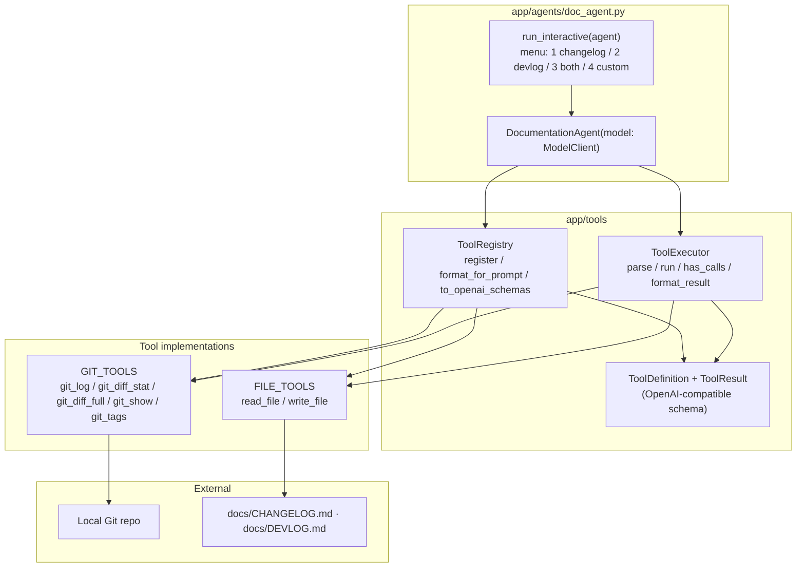
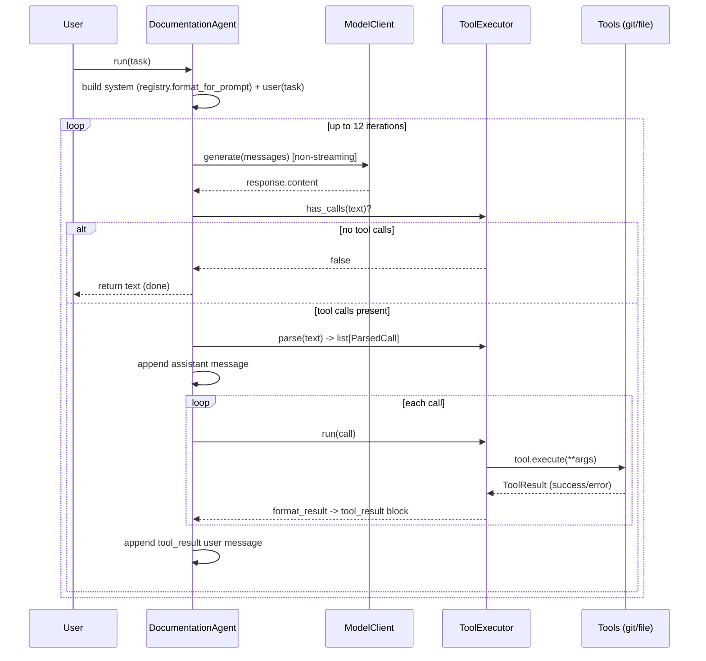
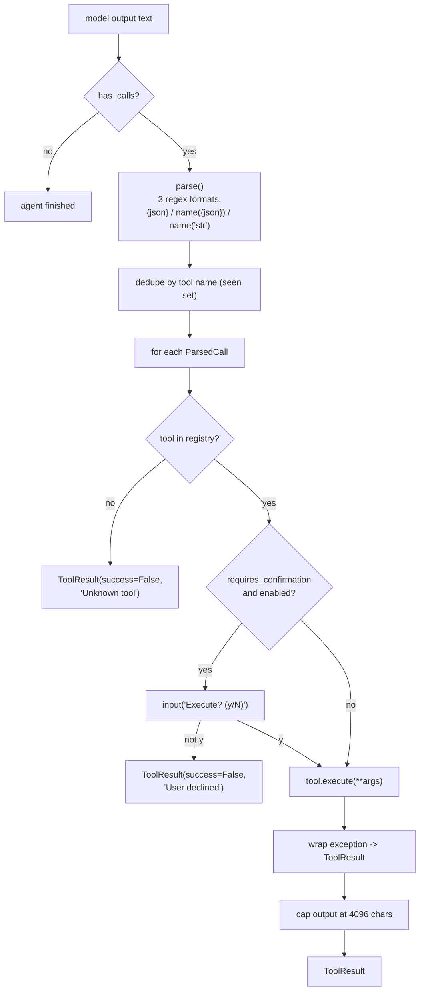
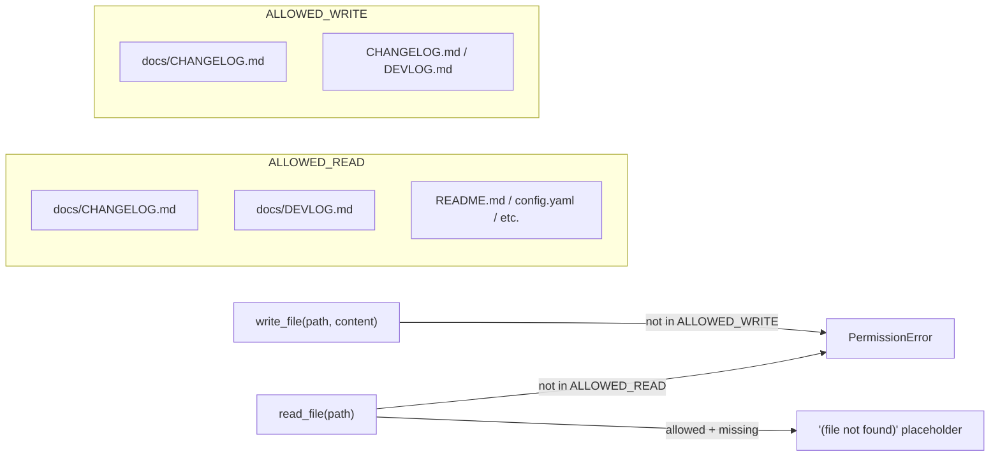

# JARVIS — Agents & Tools

> Modules: `app/agents/`, `app/tools/`. The only concrete agent is
> `DocumentationAgent` — a **mini agentic loop** using prompt-based
> `<tool_call>` parsing. The design is intentionally forward-compatible with the
> planned v3.0 full runtime (native function calling): only the parse step and
> the `model.generate()` call are expected to change.

---

## 1. Agent & Tools Overview

> `append_file` is defined in `file_tools.py` but sits **dead-code inside** the
> `append_file()` function body (after its `return`), so it is **not** in
> `FILE_TOOLS`. The agent's system prompt tells the model to use `append_file`,
> but only `write_file` (overwrite) is actually registered.

---

## 2. Agentic Loop (sequence)

`DocumentationAgent.run(task)` loops until no tool calls remain or
`MAX_ITERATIONS = 12` is hit.

---

## 3. ToolExecutor Parse/Run

`ToolExecutor` (`app/tools/executor.py`) understands three `<tool_call>` formats
and wraps every failure.

---

## 4. Tool Safety Model (v2.4)

Blast radius is enforced **inside** the tool functions, not by the caller.

| Tool | risk_level | requires_confirmation |
|------|-----------|------------------------|
| `git_log`, `git_diff_stat`, `git_diff_full`, `git_show`, `git_tags` | none | no |
| `read_file` | low | no |
| `write_file` | medium | **yes** |

> `git_branch` and `git_status` exist as functions but are **not** in `GIT_TOOLS`,
> so the agent cannot call them. Git diff output is additionally capped at 8000
> chars inside the git tools.
