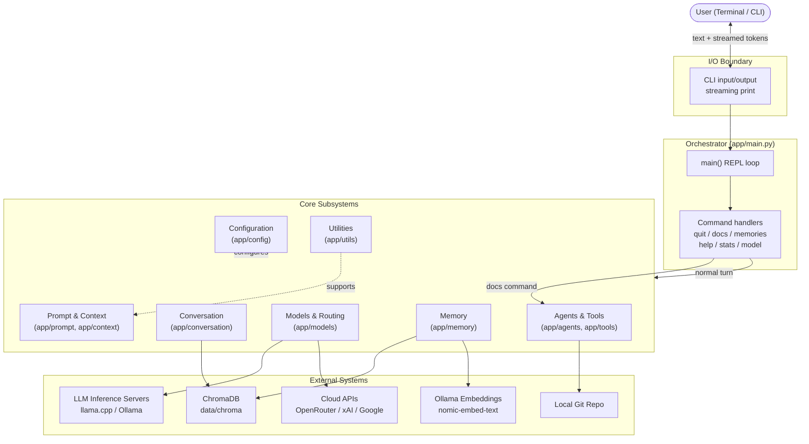
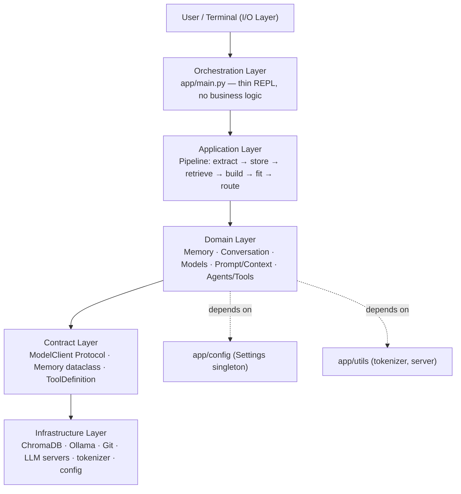
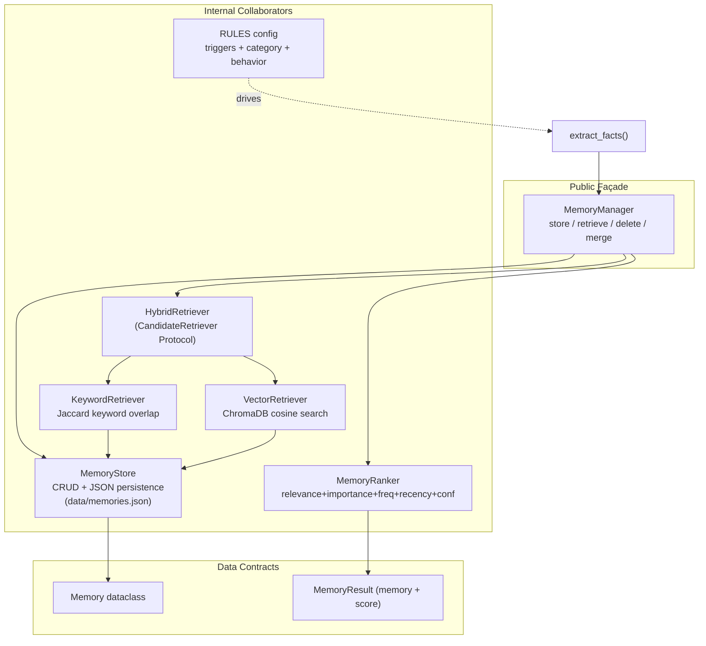
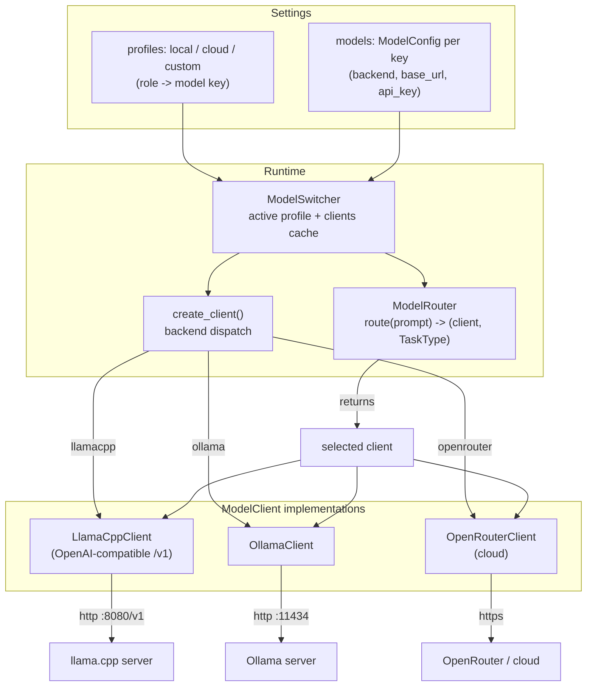
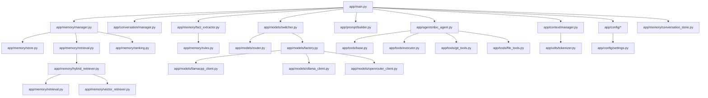

# JARVIS — Architecture (High-Level Component Diagrams)

> Source of truth: the running code under `app/` (JARVIS **v2.4.0**, per
> `app/config/version.py`). These diagrams were derived by reading the
> implementation, not from prose docs. Where a component is a placeholder
> (empty module) or dead code, it is marked explicitly.
> Source of truth: the running code under `app/`. For release identity prefer
Git tags (latest: `v2.5.0`); `app/config/version.py` may reflect a working-tree
banner that differs from committed tags. These diagrams were derived by
reading the implementation, not from prose docs. Where a component is a
placeholder (empty module) or dead code, it is marked explicitly.

JARVIS is a **local-first, modular CLI personal assistant**. Every capability —
memory, conversation, model routing, tooling — is an independent subsystem that
communicates through stable interfaces (chiefly the `ModelClient` Protocol and
the `Memory` data contract). The `app/main.py` orchestrator is intentionally
thin: it sequences calls and contains no business logic.

---

## 1. High-Level Component Diagram

The system at the highest level: the user, the CLI boundary, the orchestrator,
the major internal subsystems, and the external systems they depend on.



**Reading the diagram**
- Solid arrows are runtime data/control flow.
- Dotted arrows (`-.->`) are configuration / support relationships.
- `Memory` and `Conversation` are separate, persistent stores (facts vs. raw
  dialogue history) that never share a schema.
- `Models & Routing` is the only subsystem that talks to LLM providers; the
  router cannot tell a local `LlamaCppClient` from a cloud `OpenRouterClient`
  because both implement the same `ModelClient` Protocol.

---

## 2. Layered Architecture

How the subsystems stack and which layers depend on which.



**Key architectural rules (verified in code)**
1. Each component has **one responsibility** and communicates through stable data
   contracts, not shared internals.
2. The orchestrator (`app/main.py`) contains as little logic as possible — it
   only sequences subsystem calls.
3. Interfaces are protected; implementations are swappable. Examples:
   - Any object satisfying `ModelClient` can be a model backend.
   - `KeywordRetriever`, `VectorRetriever`, and `HybridRetriever` are
     interchangeable (`CandidateRetriever` Protocol).
   - `extract_facts()` keeps a stable `extract_facts(message) -> list[dict]`
     contract regardless of whether it is rule-based or LLM-based.

---

## 3. Request Lifecycle (Per-Turn Data Flow)

The exact sequence executed by `main()` for a normal user turn. This is the
"happy path" pipeline that grounds the component relationships above.

```mermaid
flowchart LR
    A["User input"] --> B["ConversationManager.add_message(user)"]
    B --> C["extract_facts(prompt)"]
    C --> D["MemoryManager.store(fact)<br/>apply behavior rules"]
    D --> E["MemoryManager.retrieve(prompt)"]
    C --> E
    E --> F["ConversationVectorStore.search(prompt)"]
    F --> G["PromptBuilder.build()<br/>system + memories + history + conversation"]
    G --> H["ContextWindowManager.fit()<br/>token count + pair-trim"]
    H --> I["ModelRouter.route(prompt)<br/>classify TaskType"]
    I --> J["selected_model.generate(messages, stream=True)"]
    J --> K["print streamed tokens"]
    K --> L["ConversationManager.add_message(assistant)"]
    L --> M["ConversationVectorStore.add_exchange()"]
```



> **Ordering insight (from the `app/main.py` docstring):** facts are stored
> *before* retrieval so that "My name is Sajan" is available to the *same* turn's
> context. This is why `store` sits before `retrieve` in the flow above.

---

## 4. Memory Subsystem

Internal decomposition of `app/memory`. The `MemoryManager` is the single
public façade; everything below is an internal collaborator.



**Behavior logic** lives in `MemoryManager` (append / replace / ignore / delete),
*not* in the store or extractor. The store is pure CRUD + persistence; the
extractor is pure message→fact transformation; the ranker is pure scoring.

---

## 5. Model Layer & Routing

How a prompt becomes a concrete model call. The `ModelSwitcher` builds one
`ModelRouter` per profile; the router classifies the prompt into a `TaskType`
and returns a client that satisfies `ModelClient`.



**Classification** (`ModelRouter._classify_prompt`) uses a score-based keyword
match across `CODE` / `STEM` / `REASONING` task types, with tie-breaking that
prefers more specific types. `GENERAL`/`DOCS`/`AUTOCOMPLETE` are only reachable
via explicit profile mapping, not auto-classification.

---

## 6. Agent & Tools Subsystem

The `DocumentationAgent` is the only concrete agent. It is a **mini agentic
loop** built on prompt-based `<tool_call>` parsing — the same shape planned for
the future v3.0 full runtime, but narrower in scope.

```mermaid
flowchart TB
    subgraph AGENT["DocumentationAgent.run(task)"]
        LOOP["loop (max 12 iters)<br/>model.generate(messages)"]
        PARSE{"has tool_call?"}
        EXEC["ToolExecutor.parse()"]
        RUN["ToolExecutor.run()<br/>confirm + cap + wrap"]

    ---

    ## Git history verification

    Full git history for this file (commit|author|date|subject):

    ```
    1cab1b1|Er Sajan PLG|2026-07-13 08:12:24 +0545|mermaid added in docs/architecture and mermaid dependencies
    ```

    Notes: This history was generated from the repository commit log for `docs/architecture/architecture.md`.
        INJECT["inject tool_result as user msg"]
    end

    subgraph TOOLS["Registered Tools"]
        TREG["ToolRegistry<br/>GIT_TOOLS + FILE_TOOLS"]
        GIT["git_log / git_diff_stat<br/>git_diff_full / git_show / git_tags"]
        FILE["read_file / write_file"]
    end

    subgraph EXT["External"]
        GITSRC["Local Git repo"]
        DOCS["docs/CHANGELOG.md<br/>docs/DEVLOG.md"]
    end

    LOOP --> PARSE
    PARSE -->|"yes"| EXEC
    EXEC --> RUN
    RUN --> INJECT
    INJECT --> LOOP
    PARSE -->|"no"| DONE["return final text"]

    TREG --> GIT
    TREG --> FILE
    RUN --> GIT
    RUN --> FILE
    GIT --> GITSRC
    FILE --> DOCS
```

**Tool safety model (v2.4):** blast radius is enforced *inside* the tool
functions via `ALLOWED_READ` / `ALLOWED_WRITE` allowlists; `require_confirmation`
triggers an `Execute? (y/N):` prompt for write tools; output is capped at 4096
chars before being injected back into the model context.

---

## 7. Component Dependency Map (modules)

File-level view of who imports whom, useful as a navigation aid.



**Placeholders / not-yet-implemented (verified empty or absent):**
- `app/api/__init__.py` and `app/brain/__init__.py` — empty packages (0 bytes).
- `knowledge/` — empty directory (the planned v3.3 Knowledge/RAG subsystem).
- Server auto-start in `main.py` is **commented out** (`ensure_server_running`).
- Privacy pipeline (Classifier→Sanitizer→Auditor→Personalizer) — doc-only, no module.

---

## 8. Design Principles (encapsulated)

These principles are observable as invariants in the code and are what keep the
component diagram stable as implementations evolve:

- **Separation of concerns** — store vs. retrieve vs. rank vs. behavior are
  separate modules.
- **Replaceable components** — backends, retrievers, and extractors are
  swappable behind protocols.
- **Stable contracts** — `ModelClient`, `Memory`, `ToolDefinition`, and the
  `extract_facts` signature rarely change.
- **Local-first, cloud-compatible** — works fully offline; cloud is an opt-in
  backend behind the same interface.
- **Optimize only on measured bottlenecks** — e.g. pair-trimming in
  `ContextWindowManager` exists because injecting all history blows the context
  window, not as premature abstraction.
