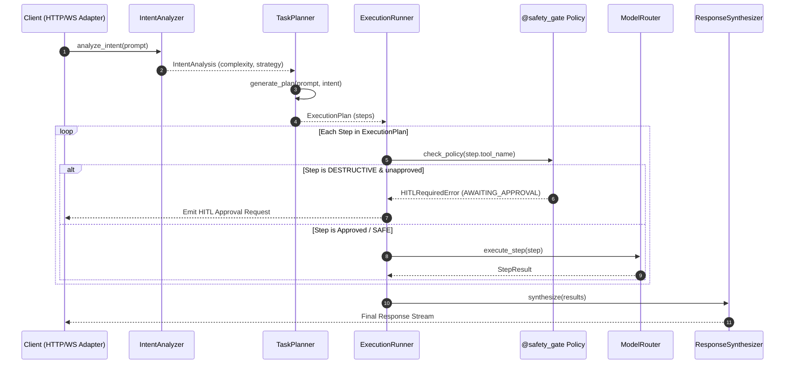

# Cognitive Brain Engine & Agent Architecture (`v3.0.0 Refactored`)

> **Source of Truth**: `app/brain/` and `app/guardrails/` at `HEAD`.
> **Timeline Metadata**: *Feature Author Date: 2026-07-28 (`f4d5e01`) | Tag Release Date: 2026-07-28*

**Status**: ACTIVE
**Last Updated**: 2026-09-13
**Source**: `app/brain/`, `app/guardrails/` at HEAD
---

## 1. Cognitive Brain Execution Cycle

Request processing is decomposed into 4 direct async execution stages:

---

## 2. Tiered Tool Safety Policy

| Tier | Policy Behavior | Example Tools |
| :--- | :--- | :--- |
| **`SAFE`** | Auto-approved execution | `calculator`, `read_file`, `get_status` |
| **`SENSITIVE`** | Logged & checked against policy rules | `write_file`, `git_commit` |
| **`DESTRUCTIVE`** | Mandatory HITL pause-and-resume gate | `delete_file`, `exec_shell`, `git_push` |
