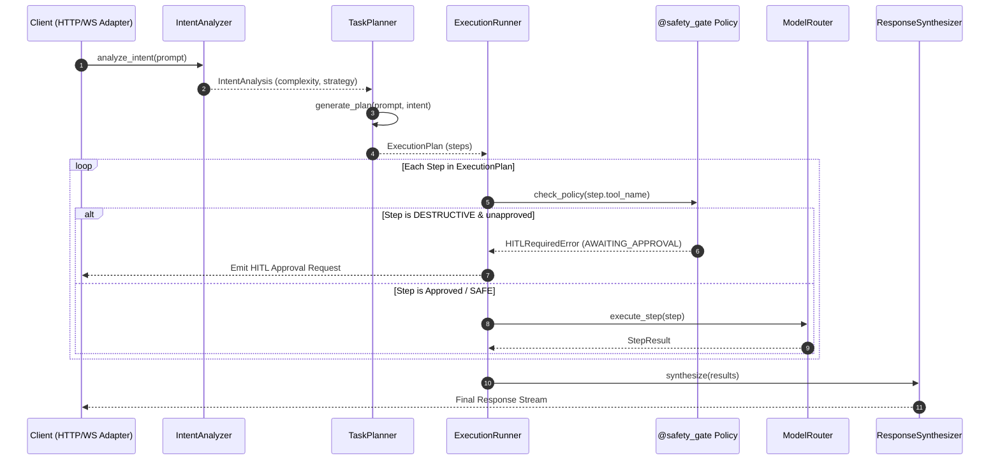

# Cognitive Brain Engine & Agent Architecture

**Status**: ACTIVE
**Type**: architecture
**Last Updated**: 2026-09-13
**Reviewed**: 2026-09-14
**Source**: `app/brain/`, `app/guardrails/` at HEAD

> **Source of Truth**: `app/brain/` and `app/guardrails/` at `HEAD`.
> **Timeline Metadata**: *Feature Author Date: 2026-07-28 (`f4d5e01`) | Tag Release Date: 2026-07-28*

---

## 0. System Overview

The cognitive brain is the request-processing core: a fixed, four-stage direct
async pipeline that turns a user turn into a response. It is deliberately not a
message bus — `app/brain/` calls each stage with `await`, and the `InMemoryAsyncBus`
is reserved for passive telemetry (ADR-006). The guardrails in `app/guardrails/`
wrap the stages rather than sitting beside them, so a tool call cannot bypass the
safety tier policy on its way through.

The invariant this document exists to protect: **the execution order is fixed and
each stage is independently replaceable**. Reordering them, or letting a stage
publish to the bus instead of returning, breaks the contract that
`docs/CAPABILITY-CONTRACT.md` §1 binds both repositories to.

---

## 1. Cognitive Brain Execution Cycle

Request processing is decomposed into 4 direct async execution stages:

---

## 2. Tiered Tool Safety Policy

| Tier | Policy Behavior | Example Tools |
| :--- | :--- | :--- |
| **`SAFE`** | Auto-approved execution | `calculator`, `read_file`, `get_status` |
| **`SENSITIVE`** | Logged & checked against policy rules | `write_file`, `git_commit` |
| **`DESTRUCTIVE`** | Mandatory HITL pause-and-resume gate | `delete_file`, `exec_shell`, `git_push` |
