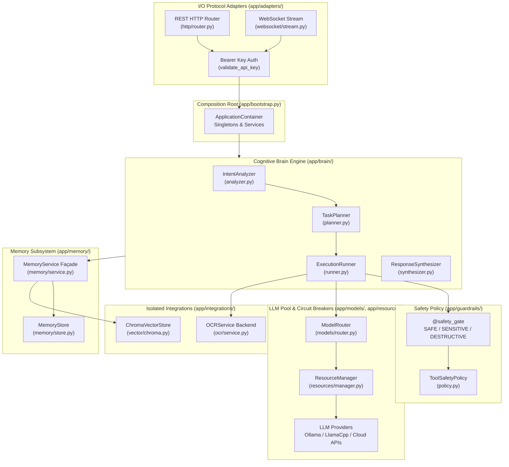

# JARVIS — Master Architecture & Component Topology (`v3.0.0 Refactored`)

> **Source of Truth**: Running implementation under `app/` at `HEAD` (`v3.0.0 Refactored`, commit `ec0dc4e`).
> **Timeline Metadata**: *Feature Author Date: 2026-07-28 (`c5a97b4` - `ec0dc4e`) | Tag Release Date: 2026-07-28*

---

## 1. High-Level Pragmatic Hybrid Architecture

JARVIS follows a **Single-Tenant Pragmatic Hybrid Architecture**. The core domain layer (`app/domain/`) is 100% pure Python dataclasses without framework dependencies. Core cognitive execution loops use direct `async/await` method calls, while passive telemetry events are published asynchronously to `InMemoryAsyncBus`.

---

## 2. Invariants at HEAD (`v3.0.0 Refactored`)

1. **Domain Purity**: `app/domain/` contains zero framework, database, or vendor imports.
2. **Composition Root**: `ApplicationContainer` in `app/bootstrap.py` is the single source of dependency injection.
3. **Safety Gates**: All destructive filesystem and command tools are wrapped with `@safety_gate` enforcing HITL approval pause states (`AWAITING_APPROVAL`).
4. **Resilient Failover**: `ResourceManager` tracks 3-state circuit breakers (`CLOSED`, `OPEN`, `HALF_OPEN`) to automatically failover from 429/503 errors.
5. **Decoupled Integrations**: Third-party libraries (`ChromaDB`, `PaddleOCR`) are isolated inside `app/integrations/`.
