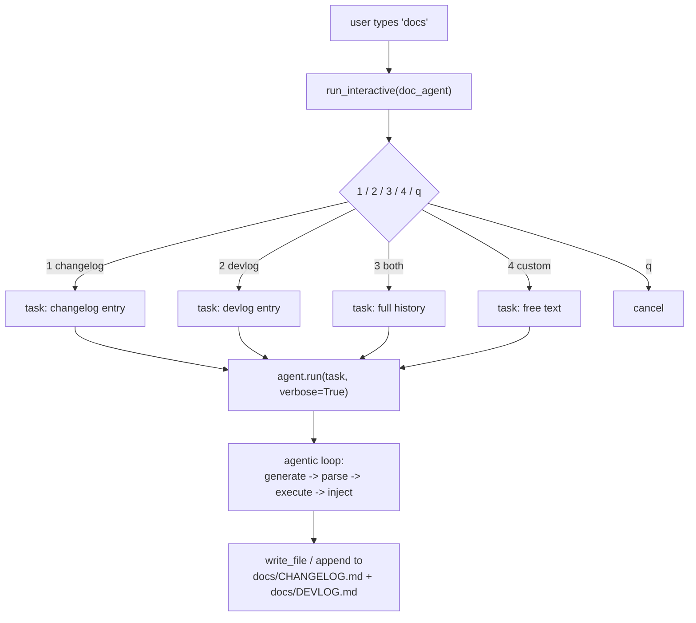
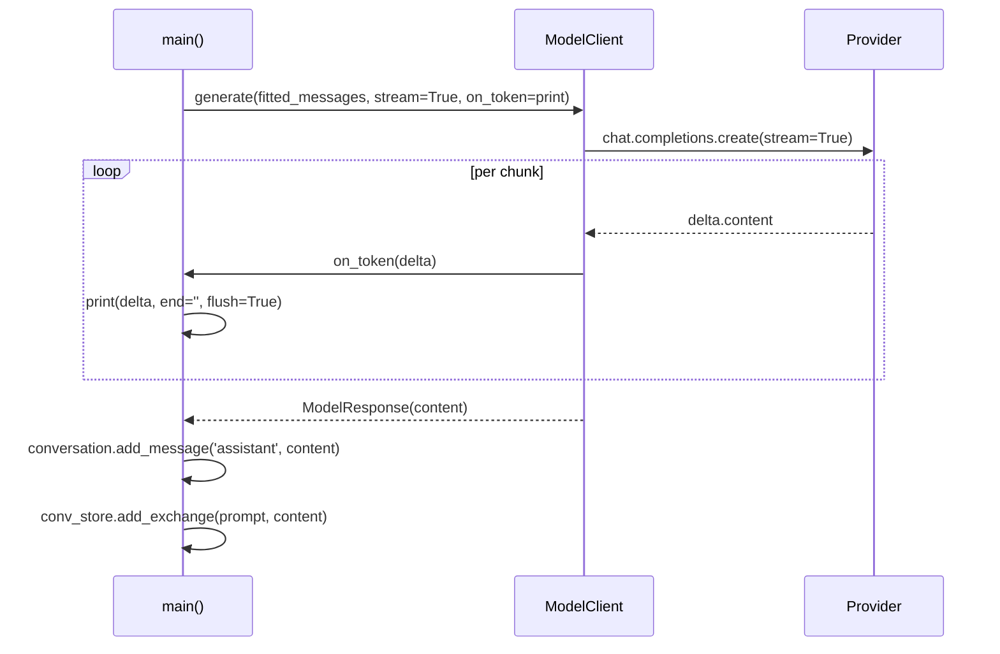
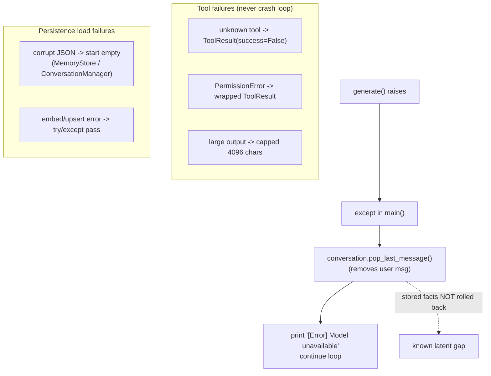

# JARVIS — Data Flow / Request Lifecycle

> Two distinct request paths exist: the **main chat pipeline** (every user turn)
> and the **documentation agent pipeline** (only on the `docs` command). Both are
> traced from `app/main.py` and the agent source.

---

## 1. Main Chat Pipeline (per turn)

The exact 10-step sequence in `main()` for a normal (non-command) input.

```mermaid
flowchart LR
    A["input('You: ')"] --> B["conversation.add_message('user', prompt)"]
    B --> C["extract_facts(prompt)<br/>rule-based -> list[dict]"]
    C --> D["memory.store(fact)<br/>store BEFORE retrieve"]
    D --> E["memory.retrieve(prompt, limit)<br/>hybrid + ranked"]
    E --> F["conv_store.search(prompt, limit=2)<br/>past exchanges"]
    F --> G["prompt_builder.build()<br/>system + memories + history + conversation"]
    G --> H["context_manager.fit(messages)<br/>count tokens + trim in pairs"]
    H --> I["switcher.router.route(prompt)<br/>-> (model, TaskType)"]
    I --> J["selected_model.generate(messages, stream=True, on_token)"]
    J --> K["print streamed tokens"]
    K --> L["conversation.add_message('assistant', response)"]
    L --> M["conv_store.add_exchange(prompt, response)"]
```



> **Ordering is deliberate:** facts are stored *before* retrieval so the same
> turn's context can use them ("My name is Sajan" is immediately recallable).

---

## 2. Documentation Agent Pipeline

Triggered only by the `docs` command via `run_interactive(doc_agent)`.



---

## 3. Streaming Response Path

How tokens flow from the provider back to the terminal.



---

## 4. Error Handling Flow

Key failure paths verified in source.



> **Latent defect (verified, currently unreachable):** immediately after
> routing, `main.py` has `if selected_model is None: selected_model =
> router.default_model` where `router` is the *imported module*, not the
> `switcher.router` instance — would raise `NameError` if reached. `select()`
> never returns `None`, so the branch is dead today.

---

## Git history verification

Full git history for this file (commit|author|date|subject):

```
1cab1b1|Er Sajan PLG|2026-07-13 08:12:24 +0545|mermaid added in docs/architecture and mermaid dependencies
```

Notes: This log was generated from the repository history for `docs/architecture/data-flow.md`.
