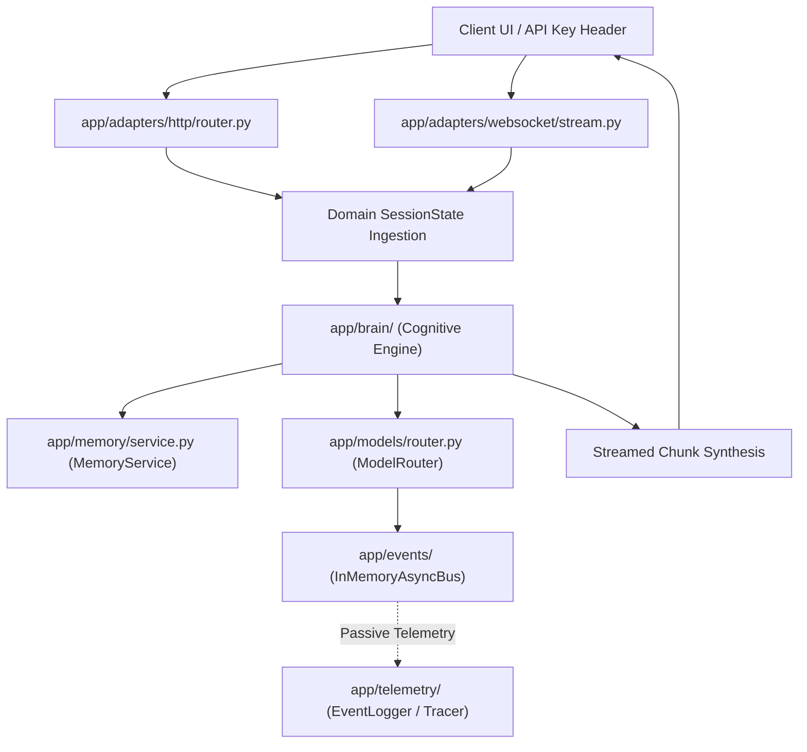

# Data Flow Architecture

**Status**: ACTIVE
**Last Updated**: 2026-09-13
**Source**: `app/domain/`, `app/brain/`, `app/adapters/` at HEAD

> **Source of Truth**: `app/domain/`, `app/brain/`, and `app/adapters/` at `HEAD`.
> **Timeline Metadata**: *Feature Author Date: 2026-07-28 (`ec0dc4e`) | Tag Release Date: 2026-07-28*

---

## 1. End-to-End Streaming Data Flow

