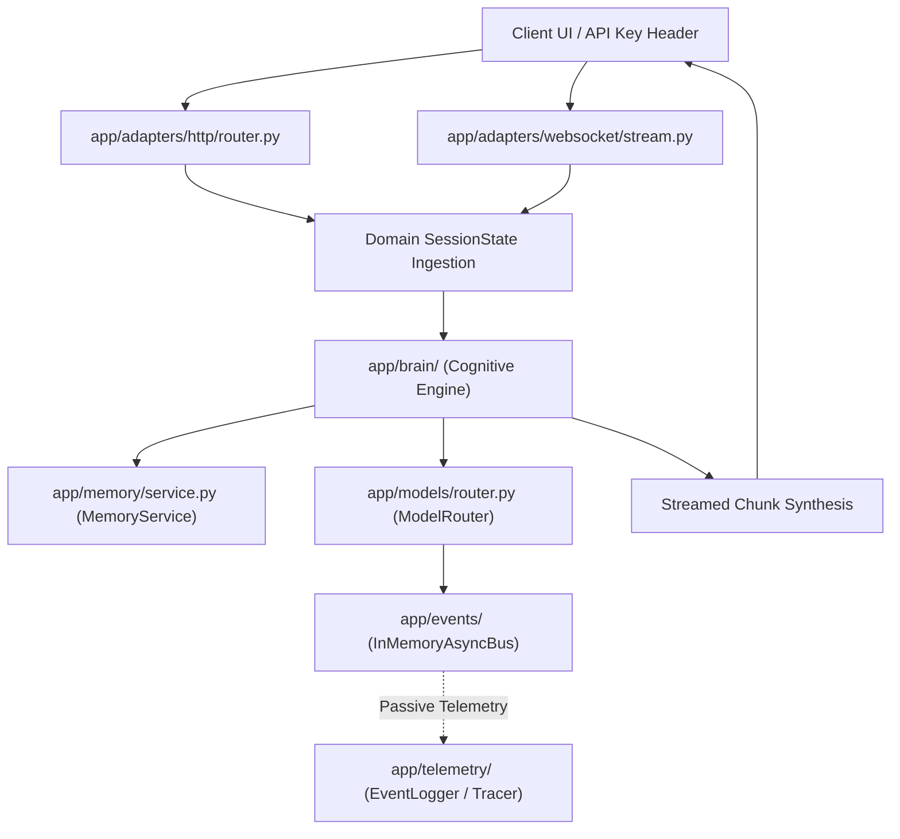

# Data Flow Architecture

**Status**: ACTIVE
**Type**: architecture
**Last Updated**: 2026-09-13
**Reviewed**: 2026-09-14
**Source**: `app/domain/`, `app/brain/`, `app/adapters/` at HEAD

> **Source of Truth**: `app/domain/`, `app/brain/`, and `app/adapters/` at `HEAD`.
> **Timeline Metadata**: *Feature Author Date: 2026-07-28 (`ec0dc4e`) | Tag Release Date: 2026-07-28*

---

## 0. System Overview

The end-to-end path is always the same shape: an adapter receives a request,
domain objects carry it inward, the brain processes it, and the response streams
back out over the same transport. `app/adapters/` is the only layer that knows
about transports (HTTP, WebSocket); `app/domain/` is the only layer that holds
state; neither imports the other's dependencies (ADR-007, ADR-010).

The invariant this document exists to protect: **state flows inward as domain
objects and outward as events, never as transport-specific structures**. A
transport type leaking past the adapter boundary is the failure this architecture
was chosen to prevent.

---

## 1. End-to-End Streaming Data Flow

