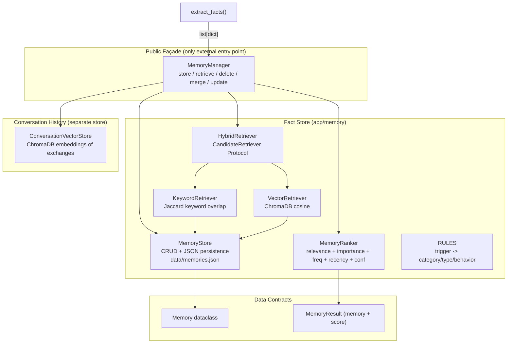
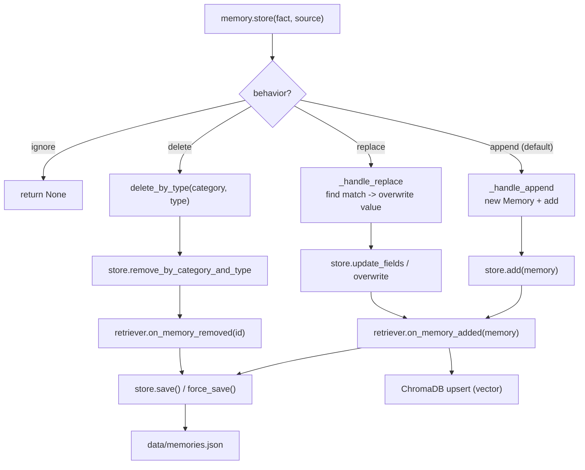
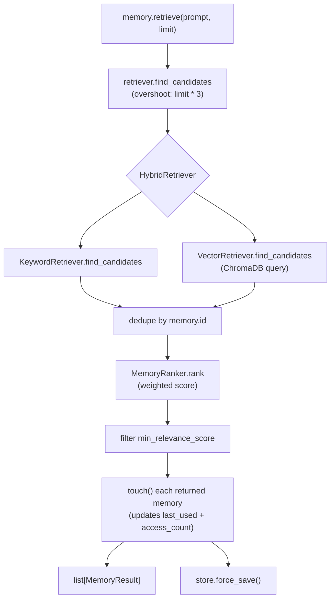
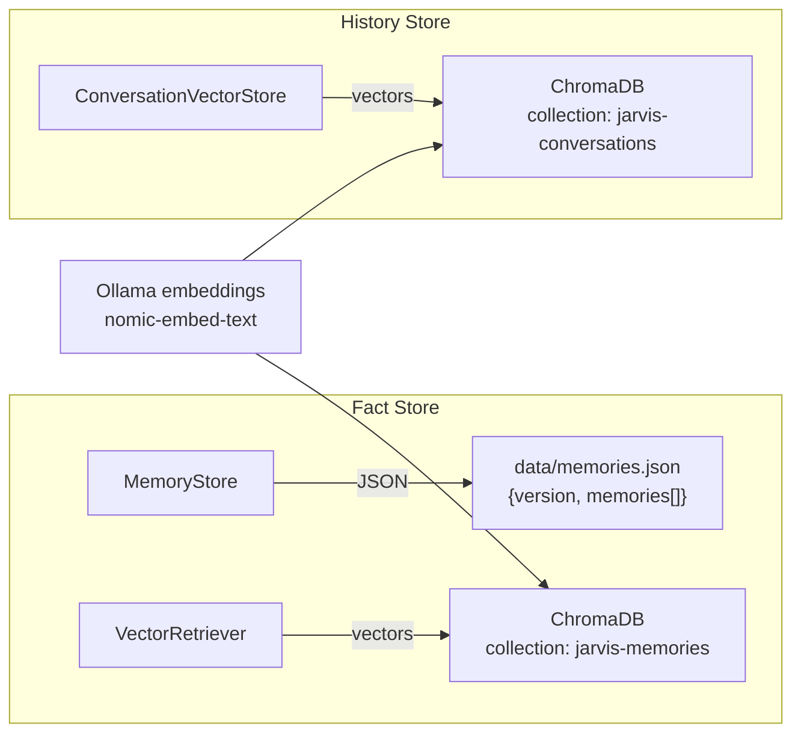
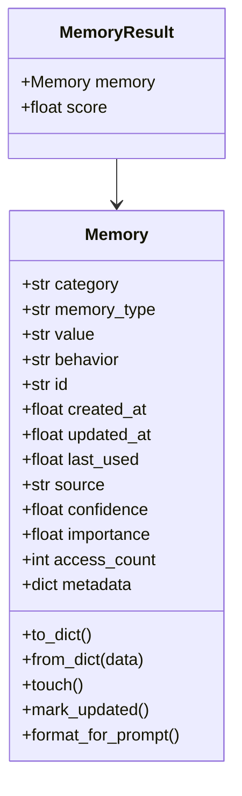

# JARVIS — Memory Subsystem

> Module: `app/memory/`. The memory subsystem has **two distinct stores**: the
> fact store (`MemoryManager` + `MemoryStore`, JSON-persisted) and the
> conversation history store (`ConversationVectorStore`, ChromaDB-persisted).
> They are never merged and never share a schema.

---

## 1. Memory Component Overview

**One responsibility each:**
- `MemoryManager` — orchestration + *behavior* logic (append/replace/ignore/delete).
- `MemoryStore` — pure CRUD + persistence (no business logic).
- `KeywordRetriever` / `VectorRetriever` / `HybridRetriever` — candidate search only.
- `MemoryRanker` — scoring only.
- `fact_extractor` + `rules` — message→fact transformation only.

---

## 2. Store (write) Flow

What happens when a fact is stored. Behavior is resolved in the manager, never
in the store.

---

## 3. Retrieve (read) Flow

What happens on `memory.retrieve(prompt, limit)`.

---

## 4. Persistence Layout

Two independent persistence mechanisms.

> The two ChromaDB collections live in the same `data/chroma` directory but are
> separate collections (different namespaces). Facts store `Memory` metadata;
> history stores `{user, assistant, timestamp}` metadata.

---

## 5. Memory Data Contract

The stable `Memory` dataclass (`app/memory/schema.py`). This schema is a
protected contract — downstream code depends on these fields.

**Behavior constants:** `append` · `replace` · `ignore` · `delete`
**Source constants:** `user` · `system` · `inferred`
**Importance constants:** `low (0.3)` · `medium (0.5)` · `high (0.7)` · `critical (0.9)`
