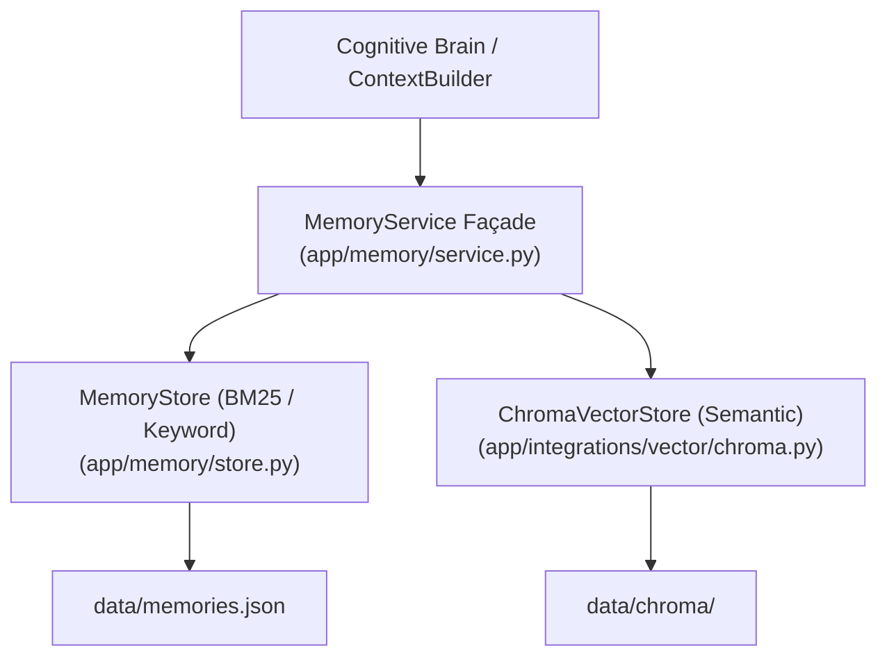

# Memory Subsystem Architecture

**Status**: ACTIVE
**Type**: architecture
**Last Updated**: 2026-09-13
**Source**: `app/memory/`, `app/integrations/vector/` at HEAD

> **Source of Truth**: `app/memory/` and `app/integrations/vector/` at `HEAD`.
> **Timeline Metadata**: *Feature Author Date: 2026-07-28 (`8a34243`) | Tag Release Date: 2026-07-28*

---

## 1. Hybrid Search & Memory Façade

