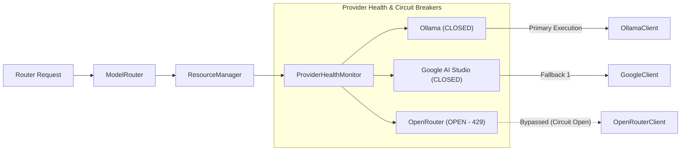

# LLM Multi-Provider Pool & Circuit Breaker Architecture

**Status**: ACTIVE
**Type**: architecture
**Last Updated**: 2026-09-30
**Reviewed**: 2026-09-14
**Source**: `app/models/`, `app/resources/` at HEAD

> **Source of Truth**: `app/models/` and `app/resources/` at `HEAD`.
> **Timeline Metadata**: *Feature Author Date: 2026-07-28 (`bb7e20b`) | Tag Release Date: 2026-07-28*

---

## 0. Read this before the diagrams below: `ModelRouter` is not on the request path

Verified 2026-09-30 at HEAD. The topology in §1 is the *designed* shape and does
not describe what runs.

- `ModelRouter`'s public API is exactly `KEYWORDS`, `classify_prompt`,
  `generate`, `register_provider`, `select_healthy_provider`. Its only
  registration path, `register_provider(provider)`, requires a
  `BaseLLMProvider`.
- **Zero classes in `app/` subclass `BaseLLMProvider`.** So `ModelRouter` can
  never be populated, and `select_healthy_provider` would raise
  `RuntimeError: No healthy LLM providers available` if anything reached it.
- Nothing calls `ModelRouter.generate` in production. The live path is
  `ModelSwitcher._clients` — a `dict[str, ModelClient]` built by
  `create_client` — resolved through `ModelSwitcher.get_client` and
  `app/adapters/web/settings.get_default`. `app/adapters/http/router.py`
  records the same conclusion in a comment: *"The router is an abandoned
  abstraction… its failover intent is already served by `OmniModelClient` over
  the `ModelClient` protocol that actually shipped."*
- `ModelSwitcher` previously called `router.register(...)` and
  `router.set_default(...)` — neither method exists on `ModelRouter`. The
  resulting `AttributeError` was swallowed by a blanket `except Exception` and
  degraded the switcher to no active profile. Those 12 call sites were removed
  on 2026-09-30; `tests/unit/test_router_call_sites.py` now guards against their
  return.

**What does fail over:** `OmniModelClient` (`app/models/omni_client.py`), which
holds a list of `ModelClient`s and is the profile `ModelSwitcher` builds across
every configured model. `ResourceManager`'s circuit breakers are real and are
consumed there, not by `ModelRouter`.

The §1 diagram and §2 state machine remain accurate as a description of the
circuit-breaker *mechanism*; read `ModelRouter` in that diagram as "the failover
layer", which is `OmniModelClient` in practice.

---

## 1. Provider Failover Topology

`ModelRouter` delegates provider health tracking and rate limiting to `ResourceManager`:

---

## 2. Circuit Breaker States

- **`CLOSED`**: Healthy provider; 100% request routing.
- **`OPEN`**: Provider returned 429/503 errors; requests routed to fallback for cooldown period.
- **`HALF_OPEN`**: Cooldown expired; testing probe requests to verify provider recovery.
