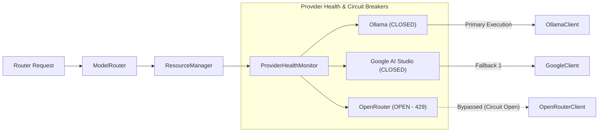

# LLM Multi-Provider Pool & Circuit Breaker Architecture

**Status**: ACTIVE
**Type**: architecture
**Last Updated**: 2026-09-13
**Reviewed**: 2026-09-14
**Source**: `app/models/`, `app/resources/` at HEAD

> **Source of Truth**: `app/models/` and `app/resources/` at `HEAD`.
> **Timeline Metadata**: *Feature Author Date: 2026-07-28 (`bb7e20b`) | Tag Release Date: 2026-07-28*

---

## 1. Provider Failover Topology

`ModelRouter` delegates provider health tracking and rate limiting to `ResourceManager`:

---

## 2. Circuit Breaker States

- **`CLOSED`**: Healthy provider; 100% request routing.
- **`OPEN`**: Provider returned 429/503 errors; requests routed to fallback for cooldown period.
- **`HALF_OPEN`**: Cooldown expired; testing probe requests to verify provider recovery.
