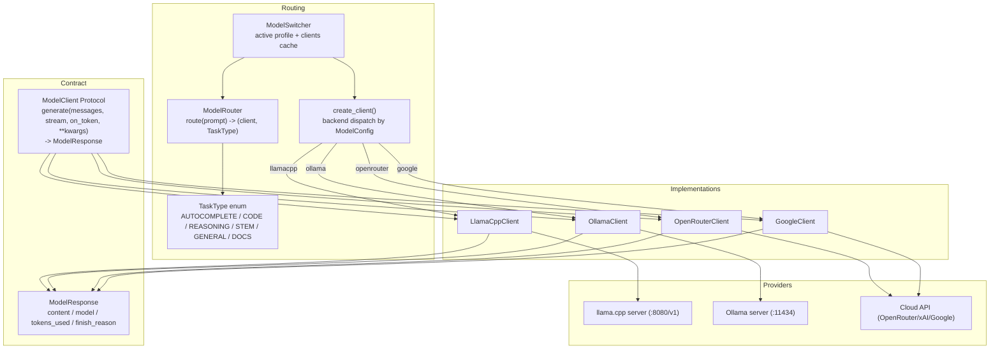
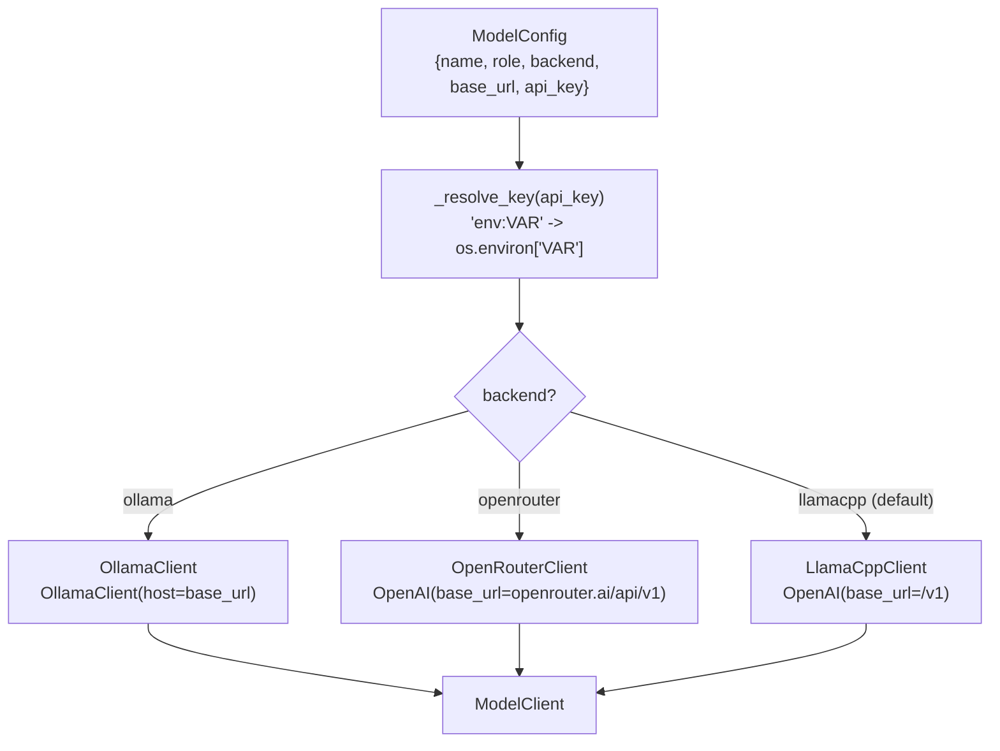
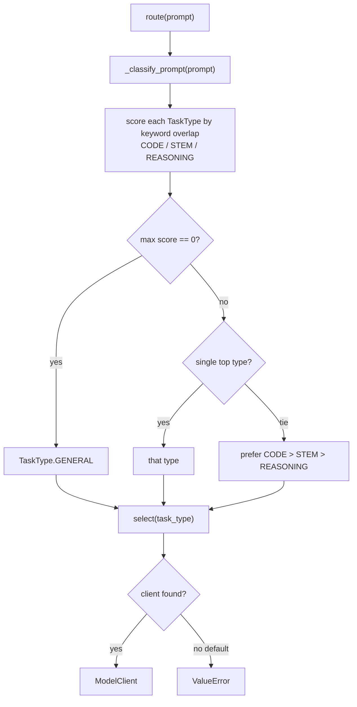
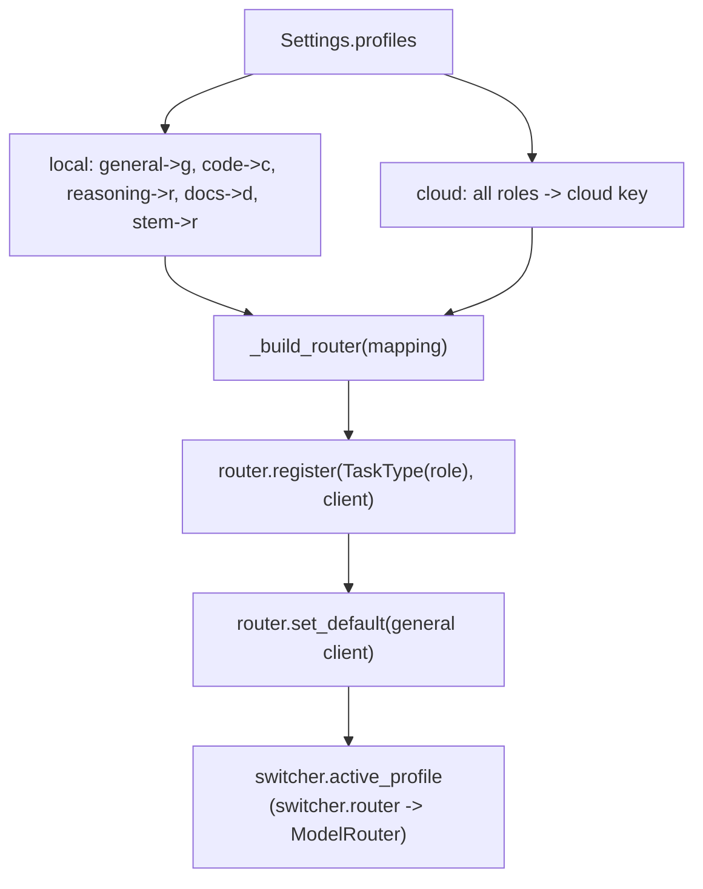
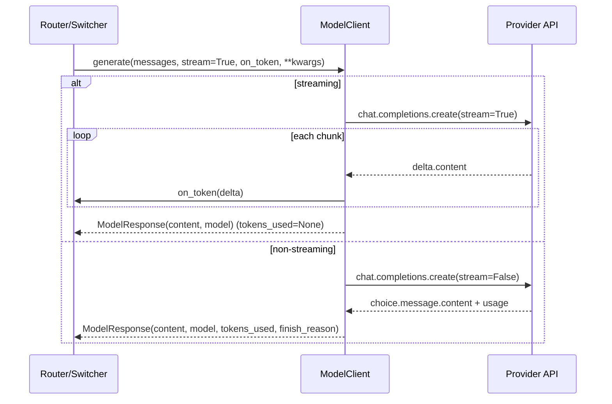

# JARVIS — Model Layer & Routing

> Module: `app/models/`. The model layer's central contract is the
> `ModelClient` Protocol. Every concrete client (`LlamaCppClient`,
> `OllamaClient`, `OpenRouterClient`, `GoogleClient`) is interchangeable — the
> router cannot tell local from cloud.

---

## 1. Model Layer Overview



---

## 2. Factory Dispatch

`create_client(config: ModelConfig)` (`app/models/factory.py`) picks a client
from the `backend` field.



> Google Gemini is handled by a dedicated `GoogleClient`
> (`app/models/google_client.py`), selected via `backend: "google"`.

---

## 3. Router Classification

`ModelRouter.route(prompt)` classifies the prompt into a `TaskType`, then
returns the registered client. Classification is **score-based** (not
first-match) to avoid order bias.



> `KEYWORDS` only defines `CODE` / `STEM` / `REASONING`. `GENERAL`, `DOCS`, and
> `AUTOCOMPLETE` are only reachable via explicit profile mapping — auto-route
> never selects them.

---

## 4. Switcher Profiles

`ModelSwitcher` (`app/models/switcher.py`) builds one `ModelRouter` per profile
from the `Settings.profiles` mapping (role -> model key).



> Client load failures are caught during `__init__` (logs `⚠️ Could not load` via `logging`)
> and startup continues. Switching to a profile with no loaded models yields a
> router that raises `ValueError` on `route()`.

---

## 5. Client Transport (generate)

`LlamaCppClient`, `OllamaClient`, and `OpenRouterClient` implement the same
`generate()` shape over an OpenAI-compatible API. `GoogleClient` uses the Gemini
REST API but exposes the identical `generate()` signature. In all cases `stream`
and `on_token` are consumed by the client; `**kwargs` are forwarded.



---

## Git history verification

Full git history for this file (commit|author|date|subject):

```
f9fa068|Er Sajan PLG|2026-07-18 18:05:40 +0545|feat: add web UI, FastAPI server, and fix batch of issues
1cab1b1|Er Sajan PLG|2026-07-13 08:12:24 +0545|mermaid added in docs/architecture and mermaid dependencies
```

Notes: This log was generated from the repository history for `docs/architecture/models.md`.
