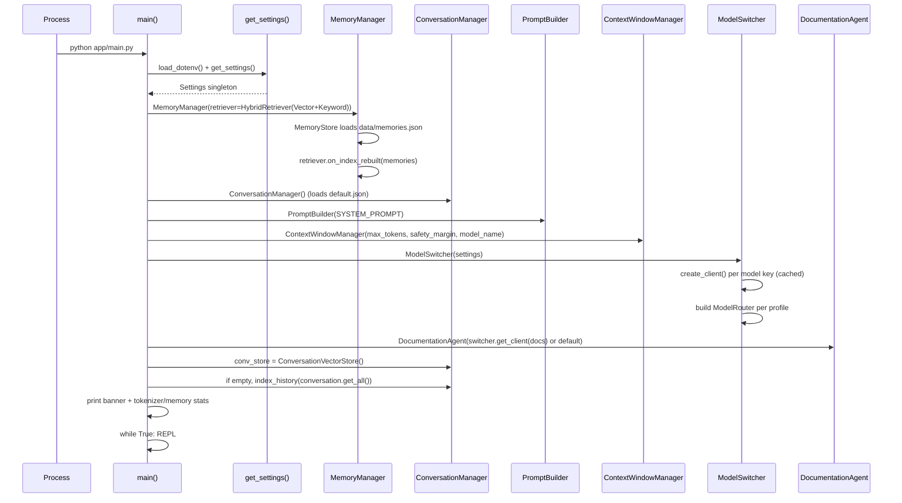
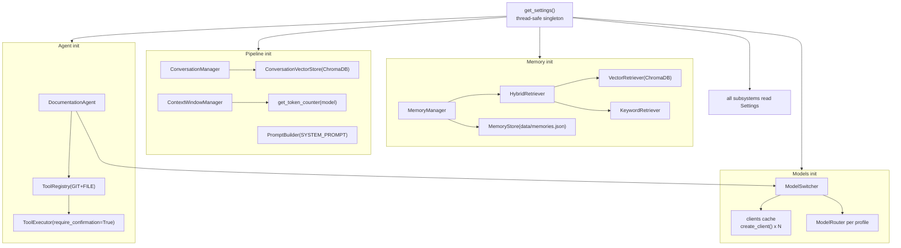
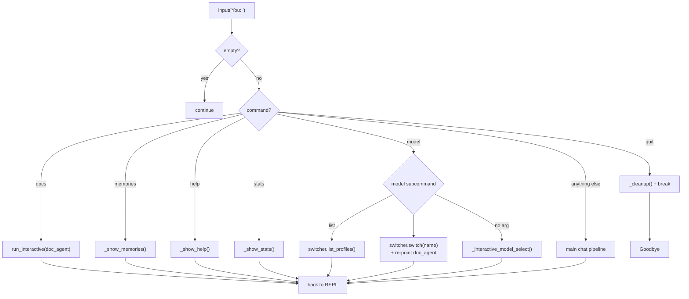

# JARVIS — Startup & Initialization Flow

> Traced from `app/main.py::main()`. The orchestrator constructs every subsystem
> once, then enters the REPL loop. Component construction order matters because
> some subsystems depend on others at init time (e.g. the retriever is seeded
> from the loaded memory store).

---

## 1. Initialization Sequence



---

## 2. Component Construction Graph

Which subsystem is wired into which at startup.



---

## 3. CLI Command Dispatch

Once the loop is running, `main()` dispatches on the raw input string.



> `Ctrl+C` / `Ctrl+D` (`KeyboardInterrupt` / `EOFError`) also trigger
> `_cleanup()` + goodbye. `_cleanup()` calls `memory.save_if_dirty()` and
> `conversation.save_if_dirty()`.

---

## Git history verification

Full git history for this file (commit|author|date|subject):

```
1cab1b1|Er Sajan PLG|2026-07-13 08:12:24 +0545|mermaid added in docs/architecture and mermaid dependencies
```

Notes: This log was generated from the repository history for `docs/architecture/startup-flow.md`.
