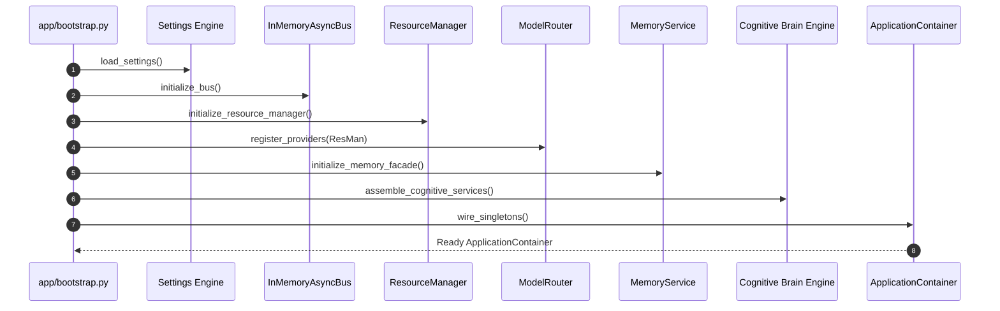

# System Startup & Composition Root (`v3.0.0 Refactored`)

**Status**: ACTIVE
**Last Updated**: 2026-09-13
**Source**: `app/bootstrap.py`, `app/main.py` at HEAD

> **Source of Truth**: `app/bootstrap.py` and `app/config/` at `HEAD`.
> **Timeline Metadata**: *Feature Author Date: 2026-07-28 (`fef3297`) | Tag Release Date: 2026-07-28*

---

## 1. Composition Root Bootstrap Sequence

