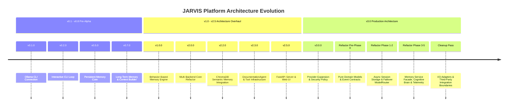

# System Evolution Timeline

**Status**: SNAPSHOT
**Type**: generated
**Last Updated**: 2026-09-13
**Reviewed**: 2026-09-14
**Generated by**: `scripts/archaeologist.py`

```mermaid
timeline
    title JARVIS Platform Architecture Evolution
    section v0.1 - v0.8 Pre-Alpha
        v0.1.0 : Ollama CLI Connection
        v0.2.0 : Interactive CLI Loop
        v0.5.0 : Persistent Memory Core
        v0.7.0 : Long-Term Memory & Context Builder
    section v1.0 - v2.5 Architecture Overhaul
        v1.0.0 : Behavior-Based Memory Engine
        v2.0.0 : Multi-Backend Core Refactor
        v2.2.0 : ChromaDB Semantic Memory Integration
        v2.3.0 : DocumentationAgent & Tool Infrastructure
        v2.5.0 : FastAPI Server & Web UI
    section v3.0 Production Architecture
        v3.0.0 : Provider Expansion & Security Policy
        Refactor Pre-Phase 0 : Pure Domain Models & Event Contracts
        Refactor Phase 1-2 : Async Session Storage & Failover ModelRouter
        Refactor Phase 3-5 : Memory Service Facade, Cognitive Brain & Telemetry
        Cleanup Pass : I/O Adapters & Third-Party Integration Boundaries
```
